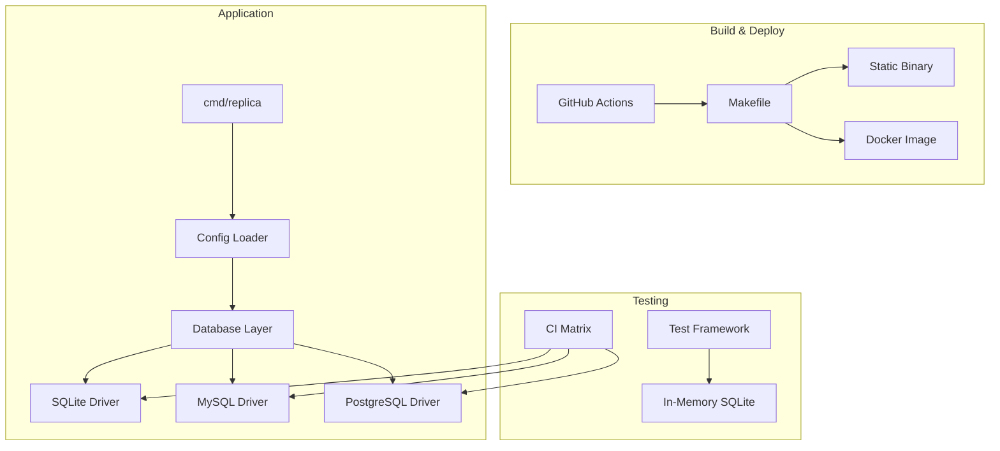

# Plan: Release 0.1.0 - Foundation Layer

## Original Work Order

> Implement the foundation layer for Replica 1.0 as the first release. This release establishes project infrastructure, configuration management, database abstraction, and testing framework required by all subsequent releases.

## Executive Summary

This release establishes the foundational infrastructure for Replica, a distributed CMS. It creates the project structure, build system, configuration management, database abstraction layer, and testing framework. No user-facing features are delivered, but all subsequent releases depend on this foundation.

The approach prioritizes multi-database support from day one, ensuring SQLite, MySQL, and PostgreSQL are all first-class backends. The testing infrastructure uses in-memory SQLite for fast unit tests while CI validates against all three databases. This foundation follows Go best practices and prepares for the authentication, content, and sync layers that follow.

## Context

### Current State vs Target State

| Current State | Target State | Why? |
|---------------|--------------|------|
| No codebase exists | Go project with build infrastructure | Foundation for all Replica development |
| No configuration system | YAML + env var configuration | Enable deployment-specific settings |
| No database support | SQLite, MySQL, PostgreSQL abstraction | Support diverse deployment environments |
| No testing framework | Unit tests + CI matrix for all databases | Ensure quality across all backends |

### Background

This is the first release in the Replica project. All architectural decisions are guided by the Replica 1.0 specification, which specifies:
- Go 1.25+ as the runtime
- golang-migrate for database migrations
- Alpine + libvips as the Docker base image
- zerolog for structured logging
- GitHub Actions for CI/CD
- release-please for automated releases

## Scope

### Included Tasks

| Task | Name | Description |
|------|------|-------------|
| 01 | Project Foundation and Build Infrastructure | Go module, project structure, Makefile, Docker, CI/CD |
| 02 | Configuration System | YAML config parsing, environment variable overrides, validation |
| 03 | Database Abstraction Layer | Multi-database support, migrations with golang-migrate |
| 04 | Testing Infrastructure | Test framework, database fixtures, CI matrix for all backends |

### Not Included

- Authentication and authorization (Release 0.2.0)
- Content management (Release 0.3.0)
- Asset handling (Release 0.4.0)
- API endpoints (Release 0.5.0)
- CLI commands beyond basic version/help (Release 0.5.0+)
- Sync functionality (Release 0.7.0)

## Architectural Approach



### Project Structure
**Objective**: Establish a maintainable Go project following community conventions

```
replica/
├── cmd/
│   └── replica/           # Main entry point
├── internal/
│   ├── config/            # Configuration loading
│   ├── database/          # Database abstraction
│   │   ├── migrations/    # golang-migrate migrations
│   │   ├── sqlite/        # SQLite driver
│   │   ├── mysql/         # MySQL driver
│   │   └── postgres/      # PostgreSQL driver
│   └── testutil/          # Test utilities
├── Makefile               # Build automation
├── Dockerfile             # Container image
├── docker-compose.yml     # Local development
└── .github/workflows/     # CI/CD pipelines
```

## Task Details

### Task 01: Project Foundation and Build Infrastructure

**Objective**: Establish the Go project with professional build infrastructure

**Deliverables**:
- Go module initialization (`go.mod` with Go 1.25+)
- Directory structure following Go conventions
- Makefile with targets: `build`, `test`, `lint`, `fmt`, `docker`
- Dockerfile using Alpine + libvips base (~50MB target)
- docker-compose.yml for local development with SQLite, MySQL, PostgreSQL
- GitHub Actions workflow for CI (lint, test, build)
- goreleaser configuration for cross-platform binary releases
- Basic `replica version` command

**Acceptance Criteria**:
- [ ] `make build` produces static binary for Linux/macOS/Windows
- [ ] `make test` runs all tests
- [ ] `make docker` builds container image under 60MB
- [ ] CI passes on all PRs
- [ ] `replica version` outputs version information

### Task 02: Configuration System

**Objective**: Implement YAML configuration with environment variable overrides

**Deliverables**:
- Configuration struct definitions for all settings
- YAML file loader with validation
- Environment variable override support (e.g., `REPLICA_DATABASE_URL`)
- Configuration documentation in code comments
- Default configuration file template

**Configuration Categories**:
```yaml
instance:
  name: "production-us-east"

database:
  driver: sqlite  # sqlite, mysql, postgres
  url: "replica.db"

server:
  host: "0.0.0.0"
  port: 8080

logging:
  level: info
  format: json
```

**Acceptance Criteria**:
- [ ] YAML configuration loads and validates
- [ ] Environment variables override YAML values
- [ ] Invalid configuration produces clear error messages
- [ ] Default configuration works out of the box

### Task 03: Database Abstraction Layer

**Objective**: Provide unified database interface supporting SQLite, MySQL, and PostgreSQL

**Deliverables**:
- Database interface abstraction
- SQLite driver implementation
- MySQL driver implementation
- PostgreSQL driver implementation
- Migration system using golang-migrate
- Connection pool configuration
- Health check functionality

**Database Interface**:
```go
type Database interface {
    Migrate() error
    Ping(ctx context.Context) error
    Close() error
    // Transaction support
    Begin(ctx context.Context) (Tx, error)
}
```

**Acceptance Criteria**:
- [ ] All three database backends connect and migrate successfully
- [ ] Migrations are database-agnostic where possible
- [ ] Connection pooling is configurable
- [ ] Database health check works for all backends

### Task 04: Testing Infrastructure

**Objective**: Establish comprehensive testing framework with multi-database CI

**Deliverables**:
- Test helper utilities for database setup/teardown
- In-memory SQLite for fast unit tests
- Docker-based test fixtures for MySQL/PostgreSQL
- GitHub Actions matrix testing all database backends
- Code coverage configuration and reporting
- gremlins mutation testing setup

**Test Categories**:
- Unit tests: Run against in-memory SQLite
- Integration tests: Run against all databases via CI matrix
- Mutation tests: gremlins configuration for coverage verification

**Acceptance Criteria**:
- [ ] `make test` runs unit tests quickly (<30s)
- [ ] CI matrix tests against SQLite, MySQL, PostgreSQL
- [ ] Code coverage reports generated
- [ ] gremlins mutation testing configured (can be run manually)

## Dependencies

This release has no external dependencies - it is the foundation.

## Success Criteria for 0.1.0

1. **Build System**: Single command builds production-ready binary
2. **Configuration**: YAML + env vars work correctly
3. **Database**: All three backends connect, migrate, and pass health checks
4. **Testing**: CI matrix green for all databases
5. **Docker**: Container image builds and runs

## Risk Considerations and Mitigation Strategies

<details>
<summary>Technical Risks</summary>

- **Multi-database SQL compatibility**: Subtle differences between SQLite, MySQL, and PostgreSQL query behavior
    - **Mitigation**: Use golang-migrate's database-agnostic features; avoid database-specific SQL; comprehensive integration tests against all backends in CI

- **libvips dependency in Docker**: C library dependency may cause build complexity
    - **Mitigation**: Use pre-built Alpine packages; document build prerequisites clearly
</details>

<details>
<summary>Implementation Risks</summary>

- **Configuration validation edge cases**: Complex validation rules may miss invalid combinations
    - **Mitigation**: Write comprehensive unit tests for configuration validation; use typed configuration structs

- **Migration ordering**: Migrations must work across all database backends
    - **Mitigation**: Test migrations on all three databases before merging; use database-agnostic DDL where possible
</details>

## Resource Requirements

### Development Skills
- Go proficiency (modules, interfaces, testing)
- Docker and container builds
- GitHub Actions CI/CD
- SQL and database administration basics for SQLite, MySQL, PostgreSQL

### Technical Infrastructure
- Go 1.25+ development environment
- Docker for local database testing
- GitHub repository with Actions enabled
- Access to test MySQL and PostgreSQL instances (via Docker)

### Dependencies
- golang-migrate (database migrations)
- zerolog (structured logging)
- yaml.v3 (configuration parsing)
- testify (test assertions - optional)

## Release Checklist

- [ ] All tasks completed and tested
- [ ] CI pipeline green
- [ ] Docker image published
- [ ] Release notes drafted
- [ ] Git tag created: v0.1.0

## Notes

- This release focuses on infrastructure only; no user-facing features
- The database interface is intentionally minimal; it will be extended in future releases as domain models are added
- Configuration categories shown are partial; future releases will add auth, object store, and sync configuration
- release-please integration may be added in a later task; goreleaser handles initial binary releases

### Change Log

- **2025-12-19**: Initial release plan created
- **2025-12-19**: Plan refinement - added Executive Summary, Context, Architectural Approach with mermaid diagram, Risk Considerations, and Resource Requirements sections per PLAN_TEMPLATE.md; renumbered Testing Infrastructure to Task 04 for this release; added future release references to "Not Included" section
- **2025-12-19**: Plan renumbered from ID 2 to ID 1 after master plan removal; removed parent_plan references
