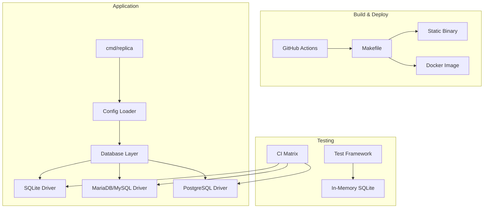
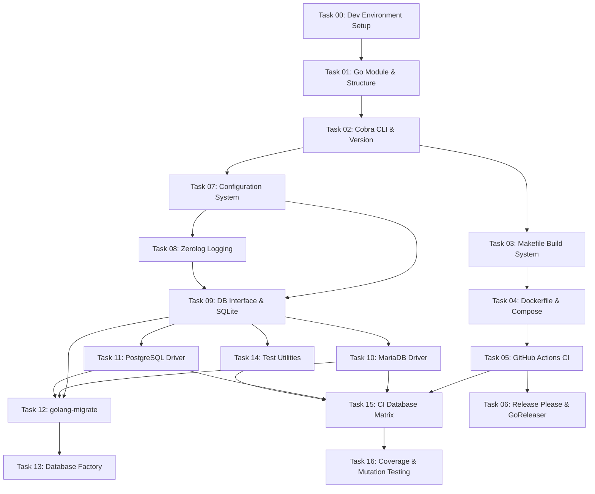

# Plan: Release 0.1.0 - Foundation Layer

## Original Work Order

> Implement the foundation layer for Replica 1.0 as the first release. This release establishes project infrastructure, configuration management, database abstraction, and testing framework required by all subsequent releases.

## Plan Clarifications

| Question | Answer |
|----------|--------|
| Go version: 1.25+ or different? | Go 1.25 is correct (latest stable) |
| SQLite driver: go-sqlite3 (CGO) or modernc.org/sqlite (pure Go)? | Keep go-sqlite3 with CGO |
| Mutation testing in 0.1.0: configure only, full CI, or defer? | Full CI integration required |
| Docker image size ceiling with CGO? | No hard limit; optimize where reasonable |
| PostgreSQL driver: lib/pq or pgx? | Use pgx with database/sql interface |
| Libvips in Docker image? | Deferred to 0.4.0 |
| CLI framework? | Cobra |
| Release automation? | release-please |
| Testing framework? | Standard library testing (no testify) |
| Go module path? | github.com/deviantintegral/replica |
| Linter for CI? | golangci-lint |
| Code coverage threshold? | 80% minimum |
| Coverage reporting tool? | go test -coverprofile with GitHub Actions |
| Mutation testing threshold? | 60% minimum |
| Database versions in CI? | Latest stable only (MariaDB 11.8, PostgreSQL 18) |
| Config file location? | ./replica.yaml (current directory) |
| License? | AGPL-3.0 |
| Docker registry? | GitHub Container Registry (ghcr.io) |
| Cross-compilation approach? | goreleaser-cross Docker image (handles CGO cross-compile) |
| SessionStart script location? | .claude/scripts/session_start.sh |
| Pre-commit hooks to configure? | golangci-lint + gofmt + conventional commits |
| Target development environment? | Debian/Ubuntu (apt-based) |
| Dependency management automation? | Renovate with auto-merge after 3 days (all update types including major) |
| Renovate config validation? | Pre-commit hook + CI job using `npx renovate-config-validator --strict` |
| Renovate custom managers? | Yes, for all bash/curl installed dependencies (Go, golangci-lint, Docker images, goreleaser-cross) |
| Conventional commit hook? | conventional-pre-commit (pre-commit hook, not commitlint) |

## Executive Summary

This release establishes the foundational infrastructure for Replica, a distributed CMS. It creates the project structure, build system, configuration management, database abstraction layer, and testing framework. No user-facing features are delivered, but all subsequent releases depend on this foundation.

The approach prioritizes multi-database support from day one, ensuring SQLite, MariaDB (MySQL-compatible), and PostgreSQL are all first-class backends. The testing infrastructure uses in-memory SQLite for fast unit tests while CI validates against all three databases with full mutation testing integration. This foundation follows Go best practices and prepares for the authentication, content, and sync layers that follow.

## Context

### Current State vs Target State

| Current State | Target State | Why? |
|---------------|--------------|------|
| No codebase exists | Go project with build infrastructure | Foundation for all Replica development |
| No configuration system | YAML + env var configuration | Enable deployment-specific settings |
| No database support | SQLite, MariaDB/MySQL, PostgreSQL abstraction | Support diverse deployment environments |
| No testing framework | Unit tests + CI matrix for all databases | Ensure quality across all backends |

### Background

This is the first release in the Replica project. All architectural decisions are guided by the Replica 1.0 specification, which specifies:
- Go 1.25+ as the runtime
- golang-migrate for database migrations
- Alpine as the Docker base image (libvips added in 0.4.0 for asset transforms)
- zerolog for structured logging
- Cobra for CLI framework
- GitHub Actions for CI/CD
- release-please for automated releases

## Scope

### Included Tasks

| Task | Name | Description |
|------|------|-------------|
| 00 | Development Environment Setup | SessionStart script for golang, pre-commit, and system-level tools |
| 01 | Project Foundation and Build Infrastructure | Go module, project structure, Makefile, Docker, CI/CD |
| 02 | Configuration System | YAML config parsing, environment variable overrides, validation |
| 03 | Database Abstraction Layer | Multi-database support, migrations with golang-migrate |
| 04 | Testing Infrastructure | Test framework, database fixtures, CI matrix for all backends |

### Not Included

- Authentication and authorization (Release 0.2.0)
- Content management (Release 0.3.0)
- Asset handling (Release 0.4.0)
- API endpoints (Release 0.5.0)
- CLI commands beyond basic version/help (Release 0.5.0+)
- Sync functionality (Release 0.7.0)

## Architectural Approach



### Project Structure
**Objective**: Establish a maintainable Go project following community conventions

```
replica/
├── cmd/
│   └── replica/           # Main entry point
├── internal/
│   ├── config/            # Configuration loading
│   ├── database/          # Database abstraction
│   │   ├── migrations/    # golang-migrate migrations
│   │   ├── sqlite/        # SQLite driver
│   │   ├── mysql/         # MariaDB/MySQL driver
│   │   └── postgres/      # PostgreSQL driver
│   └── testutil/          # Test utilities
├── Makefile               # Build automation
├── Dockerfile             # Container image
├── docker-compose.yml     # Local development
└── .github/workflows/     # CI/CD pipelines
```

## Task Details

### Task 00: Development Environment Setup

**Objective**: Create a SessionStart script that automatically installs and configures required development tools for Debian/Ubuntu-based environments

**Deliverables**:
- SessionStart script at `.claude/scripts/session_start.sh` (*per clarification*)
- Installation of Go 1.25 toolchain (*per clarification: Go 1.25 is current stable*)
- Installation and configuration of pre-commit with golangci-lint, gofmt, and conventional commits hooks (*per clarification*)
- `.pre-commit-config.yaml` configuration file for the repository
- Documentation of system-level tool requirements
- Script should be idempotent (safe to run multiple times)
- Script should be kept updated as new system-level tools are required

**System-Level Tools**:
- Go 1.25 (required for all development, installed via official Go binaries)
- pre-commit (for git hook management, installed via pip or pipx)
- golangci-lint (for linting, as specified in Task 01)
- conventional-pre-commit (for conventional commit enforcement via pre-commit hook)
- Additional tools as needed by future tasks

**Target Environment**: Debian/Ubuntu (apt-based) (*per clarification*)

**Pre-commit Hooks Configuration**:
```yaml
# .pre-commit-config.yaml
repos:
  - repo: https://github.com/golangci/golangci-lint
    hooks:
      - id: golangci-lint
  - repo: local
    hooks:
      - id: gofmt
        name: gofmt
        entry: gofmt -w
        language: system
        types: [go]
  - repo: https://github.com/compilerla/conventional-pre-commit
    hooks:
      - id: conventional-pre-commit
        stages: [commit-msg]
  # Renovate config validation (*per clarification*)
  - repo: https://github.com/renovatebot/pre-commit-hooks
    hooks:
      - id: renovate-config-validator
        args: ['--strict']
```

**Acceptance Criteria**:
- [ ] SessionStart script at `.claude/scripts/session_start.sh` executes without errors on fresh Debian/Ubuntu environment
- [ ] Go 1.25 toolchain is properly installed and accessible via `go version`
- [ ] pre-commit is installed and hooks are configured
- [ ] golangci-lint pre-commit hook runs on staged Go files
- [ ] gofmt pre-commit hook runs on staged Go files
- [ ] Conventional commit message hook validates commit messages
- [ ] Renovate config validator pre-commit hook validates `renovate.json` (*per clarification*)
- [ ] Script is idempotent (running twice produces same result)
- [ ] Script documents what it installs and why

### Task 01: Project Foundation and Build Infrastructure

**Objective**: Establish the Go project with professional build infrastructure

**Deliverables**:
- Go module initialization (`go.mod` with Go 1.25+, module path: `github.com/deviantintegral/replica`)
- Directory structure following Go conventions
- LICENSE file (AGPL-3.0)
- Makefile with targets: `build`, `test`, `lint`, `fmt`, `docker` (lint uses golangci-lint)
- Dockerfile using Alpine base (no libvips until 0.4.0)
- docker-compose.yml for local development with SQLite, MariaDB 11.8, PostgreSQL 18
- GitHub Actions workflow for CI (lint, test, build, publish to ghcr.io)
- release-please configuration for automated changelog and releases
- goreleaser configuration using goreleaser-cross for CGO cross-compilation (Linux/macOS/Windows)
- Basic `replica version` command using Cobra CLI framework
- Renovate configuration (`renovate.json`) with auto-merge after 3 days and custom managers (*per clarification*)

**Renovate Configuration** (*per clarification*):
```json
{
  "$schema": "https://docs.renovatebot.com/renovate-schema.json",
  "extends": ["config:recommended", "helpers:pinGitHubActionDigests"],
  "packageRules": [
    {
      "matchUpdateTypes": ["major", "minor", "patch"],
      "automerge": true,
      "minimumReleaseAge": "3 days"
    }
  ],
  "customManagers": [
    {
      "customType": "regex",
      "fileMatch": ["^\\.claude/scripts/session_start\\.sh$"],
      "matchStrings": [
        "GO_VERSION=\"(?<currentValue>\\d+\\.\\d+(\\.\\d+)?)\""
      ],
      "depNameTemplate": "golang",
      "datasourceTemplate": "golang-version"
    },
    {
      "customType": "regex",
      "fileMatch": ["^\\.claude/scripts/session_start\\.sh$"],
      "matchStrings": [
        "GOLANGCI_LINT_VERSION=\"(?<currentValue>v\\d+\\.\\d+\\.\\d+)\""
      ],
      "depNameTemplate": "golangci/golangci-lint",
      "datasourceTemplate": "github-releases"
    },
    {
      "customType": "regex",
      "fileMatch": ["^Dockerfile$", "^\\.goreleaser\\.ya?ml$"],
      "matchStrings": [
        "FROM\\s+(?<depName>[^:]+):(?<currentValue>[^\\s]+)"
      ],
      "datasourceTemplate": "docker"
    },
    {
      "customType": "regex",
      "fileMatch": ["^\\.goreleaser\\.ya?ml$"],
      "matchStrings": [
        "image:\\s*['\"]?(?<depName>goreleaser/goreleaser-cross):(?<currentValue>[^\\s'\"]+)"
      ],
      "datasourceTemplate": "docker"
    }
  ]
}
```

**Acceptance Criteria**:
- [ ] `make build` produces static binary for Linux/macOS/Windows
- [ ] `make test` runs all tests
- [ ] `make docker` builds container image (no libvips; optimize size where reasonable)
- [ ] CI passes on all PRs
- [ ] release-please creates releases from conventional commits
- [ ] `replica version` outputs version information (using Cobra)
- [ ] `renovate.json` validates with `npx renovate-config-validator --strict` (*per clarification*)
- [ ] Renovate custom managers detect Go version, golangci-lint version, and Docker base images (*per clarification*)

### Task 02: Configuration System

**Objective**: Implement YAML configuration with environment variable overrides

**Deliverables**:
- Configuration struct definitions for all settings
- YAML file loader with validation (default path: `./replica.yaml`)
- Environment variable override support (e.g., `REPLICA_DATABASE_DRIVER`)
- Configuration documentation in code comments
- Default configuration file template (`replica.yaml.example`)

**Configuration Categories**:
```yaml
instance:
  name: "production-us-east"

database:
  driver: sqlite  # sqlite, mariadb, postgres
  url: "replica.db"

server:
  host: "0.0.0.0"
  port: 8080

logging:
  level: info
  format: json
```

**Acceptance Criteria**:
- [ ] YAML configuration loads and validates
- [ ] Environment variables override YAML values
- [ ] Invalid configuration produces clear error messages
- [ ] Default configuration works out of the box

### Task 03: Database Abstraction Layer

**Objective**: Provide unified database interface supporting SQLite, MariaDB/MySQL, and PostgreSQL

**Deliverables**:
- Database interface abstraction
- SQLite driver implementation
- MariaDB/MySQL driver implementation
- PostgreSQL driver implementation
- Migration system using golang-migrate
- Connection pool configuration
- Health check functionality

**Database Interface** (using standard database/sql):
```go
type Database interface {
    // Access underlying *sql.DB for queries
    DB() *sql.DB
    Migrate() error
    Ping(ctx context.Context) error
    Close() error
    // Transaction support
    Begin(ctx context.Context) (Tx, error)
}

// Drivers (all implement database/sql):
// - github.com/mattn/go-sqlite3 (SQLite, CGO required)
// - github.com/go-sql-driver/mysql (MariaDB/MySQL)
// - github.com/jackc/pgx/v5/stdlib (PostgreSQL, database/sql compatible)
```

**Acceptance Criteria**:
- [ ] All three database backends connect and migrate successfully
- [ ] Migrations are database-agnostic where possible
- [ ] Connection pooling is configurable
- [ ] Database health check works for all backends

### Task 04: Testing Infrastructure

**Objective**: Establish comprehensive testing framework with multi-database CI

**Deliverables**:
- Test helper utilities for database setup/teardown
- In-memory SQLite for fast unit tests
- Docker-based test fixtures for MariaDB/PostgreSQL
- GitHub Actions matrix testing all database backends
- Code coverage configuration and reporting
- gremlins mutation testing with full CI integration

**Test Categories**:
- Unit tests: Run against in-memory SQLite, using Go's standard `testing` package
- Integration tests: Run against all databases via CI matrix
- Mutation tests: gremlins with full CI integration (must pass before merge)

**Acceptance Criteria**:
- [ ] `make test` runs unit tests quickly (<30s)
- [ ] CI matrix tests against SQLite, MariaDB 11.8, PostgreSQL 18
- [ ] Code coverage ≥80% (CI fails below threshold)
- [ ] gremlins mutation score ≥60% (CI fails below threshold)

## Dependencies

This release has no external dependencies - it is the foundation.

## Success Criteria for 0.1.0

1. **Build System**: Single command builds production-ready binary
2. **Configuration**: YAML + env vars work correctly
3. **Database**: All three backends connect, migrate, and pass health checks
4. **Testing**: CI matrix green for all databases
5. **Docker**: Container image builds and runs

## Risk Considerations and Mitigation Strategies

<details>
<summary>Technical Risks</summary>

- **Multi-database SQL compatibility**: Subtle differences between SQLite, MariaDB, and PostgreSQL query behavior
    - **Mitigation**: Use golang-migrate's database-agnostic features; avoid database-specific SQL; comprehensive integration tests against all backends in CI; use database/sql interface uniformly across all drivers (go-sqlite3, go-sql-driver/mysql, pgx/v5/stdlib)
</details>

<details>
<summary>Implementation Risks</summary>

- **Configuration validation edge cases**: Complex validation rules may miss invalid combinations
    - **Mitigation**: Write comprehensive unit tests for configuration validation; use typed configuration structs

- **Migration ordering**: Migrations must work across all database backends
    - **Mitigation**: Test migrations on all three databases before merging; use database-agnostic DDL where possible
</details>

## Resource Requirements

### Development Skills
- Go proficiency (modules, interfaces, testing)
- Docker and container builds
- GitHub Actions CI/CD
- SQL and database administration basics for SQLite, MariaDB, PostgreSQL

### Technical Infrastructure
- Go 1.25+ development environment
- Docker for local database testing
- GitHub repository with Actions enabled
- Access to test MariaDB and PostgreSQL instances (via Docker)

### Dependencies
- golang-migrate (database migrations)
- zerolog (structured logging)
- yaml.v3 (configuration parsing)
- cobra (CLI framework)
- golangci-lint (linting)
- gremlins (mutation testing)
- renovate (dependency automation) (*per clarification*)
- Database drivers using database/sql interface:
  - github.com/mattn/go-sqlite3 (SQLite, CGO required)
  - github.com/go-sql-driver/mysql (MariaDB/MySQL)
  - github.com/jackc/pgx/v5/stdlib (PostgreSQL)

## Release Checklist

- [ ] All tasks completed and tested
- [ ] CI pipeline green
- [ ] Docker image published
- [ ] Release notes drafted
- [ ] Git tag created: v0.1.0

## Notes

- This release focuses on infrastructure only; no user-facing features
- The database interface is intentionally minimal; it will be extended in future releases as domain models are added
- Configuration categories shown are partial; future releases will add auth, object store, and sync configuration
- Cobra CLI framework included from the start to support future commands
- All database drivers use the standard database/sql interface for uniform abstraction
- Docker image excludes libvips; it will be added in Release 0.4.0 (Asset Management)
- *Per clarification*: PostgreSQL uses pgx/v5/stdlib instead of lib/pq for better performance and active maintenance
- *Per clarification*: Mutation testing (gremlins) is fully integrated in CI, not just configured
- *Per clarification*: Renovate configured for automated dependency updates with 3-day auto-merge delay for all update types (including major)
- *Per clarification*: CI includes Renovate config validation job using `npx renovate-config-validator --strict`
- *Per clarification*: Renovate custom managers track versions in `session_start.sh` (Go, golangci-lint) and Dockerfile base images

### Change Log

- **2025-12-19**: Initial release plan created
- **2025-12-19**: Plan refinement - added Executive Summary, Context, Architectural Approach with mermaid diagram, Risk Considerations, and Resource Requirements sections per PLAN_TEMPLATE.md; renumbered Testing Infrastructure to Task 04 for this release; added future release references to "Not Included" section
- **2025-12-19**: Plan renumbered from ID 2 to ID 1 after master plan removal; removed parent_plan references
- **2025-12-19**: Clarifications incorporated: deferred libvips to 0.4.0; added Cobra CLI framework; added release-please; specified database/sql with lib/pq for PostgreSQL abstraction; confirmed standard library testing (no testify); confirmed go-sqlite3 (CGO) for SQLite driver
- **2025-12-19**: Plan refinement session - Updated PostgreSQL driver from lib/pq to pgx/v5/stdlib; upgraded mutation testing from "configure only" to full CI integration; removed hard Docker image size limit (optimize where reasonable); added Plan Clarifications table with all Q&A
- **2025-12-19**: Additional clarifications - Set Go module path to github.com/deviantintegral/replica; confirmed golangci-lint for linting; set coverage threshold to 80% and mutation threshold to 60%; specified MySQL 8.4 and PostgreSQL 17 for CI; set config file path to ./replica.yaml
- **2025-12-19**: Final clarifications - Set license to AGPL-3.0; Docker images to ghcr.io; cross-compilation via goreleaser-cross Docker image for CGO support
- **2025-12-19**: Updated to use MariaDB instead of MySQL for all tests, CI jobs, and docker-compose; MySQL compatibility retained via go-sql-driver/mysql
- **2025-12-19**: Updated to latest stable versions: MariaDB 11.8, PostgreSQL 18
- **2026-01-14**: Tasks generated (17 tasks: 00-16) and execution blueprint created
- **2026-01-14**: Added Task 00: Development Environment Setup (SessionStart script for golang, pre-commit, system tools)
- **2026-01-14**: Refined Task 00 with clarifications: script path (.claude/scripts/session_start.sh), pre-commit hooks (golangci-lint + gofmt + conventional commits), target environment (Debian/Ubuntu), added .pre-commit-config.yaml example and expanded acceptance criteria
- **2026-01-14**: Task file 00--dev-environment-setup.md generated; updated Task 01 dependencies to include Task 00
- **2026-01-15**: Added Renovate configuration requirements: auto-merge after 3 days, pre-commit hook validation, CI validation job, custom managers for bash/curl dependencies (Go, golangci-lint, Docker images)
- **2026-01-15**: Updated Renovate config: removed schedule, enabled auto-merge for all update types including major
- **2026-01-15**: Plan refinement session - Added coverage reporting tool clarification (go test -coverprofile); confirmed conventional-pre-commit as commit hook (removed commitlint ambiguity); added goreleaser-cross to Renovate custom managers; fixed task count in changelog (17 tasks: 00-16)
- **2026-01-15**: Task files regenerated (17 tasks: 00-16) with detailed implementation notes; complexity analysis performed (all tasks ≤5); task IDs and dependencies aligned with execution blueprint

## Task Dependency Visualization



## Execution Blueprint

**Validation Gates:**
- Reference: `/config/hooks/POST_PHASE.md`

### Phase 0: Development Environment Setup
**Parallel Tasks:**
- Task 00: Development Environment Setup (SessionStart script for golang, pre-commit, system tools)

### Phase 1: Project Initialization
**Parallel Tasks:**
- Task 01: Go Module and Project Structure (depends on: 00)

### Phase 2: CLI and Configuration Foundation
**Parallel Tasks:**
- Task 02: Cobra CLI and Version Command (depends on: 01)

### Phase 3: Build System and Config
**Parallel Tasks:**
- Task 03: Makefile Build System (depends on: 02)
- Task 07: Configuration System (depends on: 02)

### Phase 4: Docker and Logging
**Parallel Tasks:**
- Task 04: Dockerfile and Docker Compose (depends on: 03)
- Task 08: Zerolog Logging Integration (depends on: 07)

### Phase 5: CI and Database Interface
**Parallel Tasks:**
- Task 05: GitHub Actions CI Workflow (depends on: 04)
- Task 09: Database Interface and SQLite Driver (depends on: 07, 08)

### Phase 6: Release Automation and DB Drivers
**Parallel Tasks:**
- Task 06: Release Please and GoReleaser Configuration (depends on: 05)
- Task 10: MariaDB/MySQL Driver (depends on: 09)
- Task 11: PostgreSQL Driver (depends on: 09)
- Task 14: Test Utilities (depends on: 09)

### Phase 7: Migration System
**Parallel Tasks:**
- Task 12: golang-migrate Integration (depends on: 09, 10, 11)

### Phase 8: Database Factory and CI Matrix
**Parallel Tasks:**
- Task 13: Database Factory (depends on: 12)
- Task 15: CI Database Matrix Testing (depends on: 05, 10, 11, 14)

### Phase 9: Quality Gates
**Parallel Tasks:**
- Task 16: Coverage and Mutation Testing (depends on: 15)

### Post-phase Actions
- Run `make test` to verify all unit tests pass
- Run `make lint` to ensure code quality
- Verify Docker build succeeds
- Confirm CI pipeline is green

### Execution Summary
- Total Phases: 10
- Total Tasks: 17
- Maximum Parallelism: 4 tasks (in Phase 6)
- Critical Path Length: 10 phases (00 → 01 → 02 → 03 → 04 → 05 → 15 → 16)
