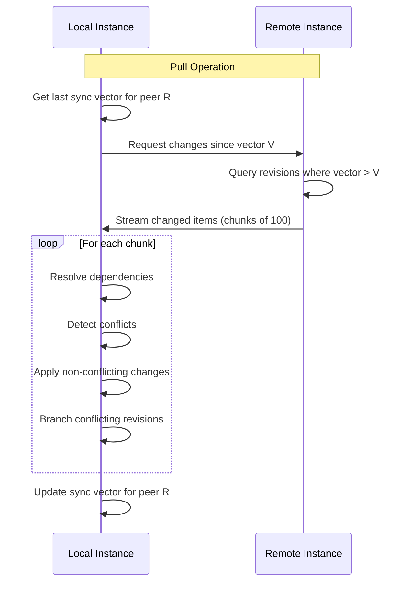
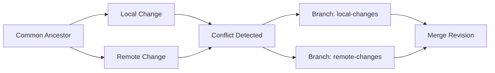

# Release 0.7.0: Sync Engine

## Release Overview

This release transforms Replica from a single-instance CMS into a distributed content system. After this release, Replica instances can push and pull content from each other, detect and resolve conflicts, and maintain synchronized content across federated deployments.

This is the core differentiating feature of Replica - the distributed content model that enables production-to-staging sync, blue/green deployments, and content distribution networks.

## Prerequisites

- Release 0.6.0 (Background Processing) completed

## Scope

### Included Tasks

| Task | Name | Description |
|------|------|-------------|
| 17 | Sync Engine Core | Bidirectional push/pull with delta sync |
| 18 | Conflict Resolution | Version branching with manual merge |
| 19 | Peer Registration | Instance federation management |

### Not Included

- AI-assisted conflict resolution (deferred to post-1.0)
- CLI sync commands (0.8.0)
- Observability integration (0.8.0)

## Architecture Additions

```
internal/
├── sync/
│   ├── engine.go          # Sync orchestration
│   ├── push.go            # Push operations
│   ├── pull.go            # Pull operations
│   ├── delta.go           # Delta calculation
│   ├── chunk.go           # Chunked transfer
│   ├── dependency.go      # Reference resolution
│   ├── protocol.go        # Wire protocol
│   └── vector_clock.go    # Vector clock operations
├── conflict/
│   ├── detector.go        # Conflict detection
│   ├── branch.go          # Version branching
│   ├── resolver.go        # Manual resolution
│   └── merge.go           # Merge operations
└── peer/
    ├── service.go         # Peer management
    ├── registry.go        # Peer storage
    ├── client.go          # Remote API client
    └── auth.go            # Peer authentication
```

## Task Details

### Task 17: Sync Engine Core

**Objective**: Implement bidirectional content synchronization with delta efficiency

**Sync Operations**:

```go
type SyncEngine interface {
    // Pull content from remote peer
    Pull(ctx context.Context, peerID uuid.UUID, opts PullOptions) (*SyncResult, error)

    // Push content to remote peer
    Push(ctx context.Context, peerID uuid.UUID, opts PushOptions) (*SyncResult, error)

    // Get sync status with peer
    Status(ctx context.Context, peerID uuid.UUID) (*SyncStatus, error)
}

type PullOptions struct {
    Query           ContentQuery    // Filter what to pull
    IncludeAssets   bool           // Copy assets to local store
    SchemaVersion   *string        // Transform to specific version
    DryRun          bool           // Preview without applying
}

type PushOptions struct {
    Query           ContentQuery    // Filter what to push
    IncludeAssets   bool           // Push assets to remote
    Force           bool           // Push even if remote has changes
}

type SyncResult struct {
    ItemsSynced     int
    ItemsSkipped    int
    Conflicts       []ConflictInfo
    Errors          []SyncError
    Duration        time.Duration
    BytesTransferred int64
}
```

**Delta Sync Algorithm**:



**Per-Peer Vector Clock (Git-like model)**:

```go
type PeerSyncState struct {
    PeerID      uuid.UUID
    LastVector  VectorClock  // Like Git's refs/remotes/origin/main
    LastSyncAt  time.Time
    LastResult  *SyncResult
}

// Vector clock tracks logical time per instance
type VectorClock map[uuid.UUID]uint64  // instance ID → counter
```

**Query-Based Filtering**:
```go
type ContentQuery struct {
    ContentTypes []string          // Filter by type
    IDs          []uuid.UUID       // Specific items
    Tags         []string          // Tag filter
    UpdatedAfter *time.Time        // Time-based filter
    States       []string          // Workflow states
    Custom       map[string]any    // Field filters
}
```

**Chunked Transfer**:
- Default chunk size: 100 items
- Each chunk is a complete, valid payload
- Resume capability via cursor
- Progress tracking per chunk

**Dependency Resolution**:
- Before syncing item, ensure all referenced items exist
- Automatically include referenced content in sync
- Handle circular references atomically

**Asset Sync Optimization**:
- Track `RevisionPos` for each asset
- Only transfer assets where `RevisionPos > lastSyncedRevision`
- Options: reference-only, copy-on-sync, lazy-copy

**API Endpoints**:
```
POST   /v1/sync/pull           # Pull from peer
POST   /v1/sync/push           # Push to peer
GET    /v1/sync/status/{peer}  # Sync status with peer
POST   /v1/sync/preview        # Dry run sync
```

**Deliverables**:
- Pull operation with delta calculation
- Push operation with validation
- Per-peer vector clock tracking
- Query-based content filtering
- Chunked transfer with resume
- Dependency resolution
- Asset sync with optimization
- Sync progress API

**Acceptance Criteria**:
- [ ] Pull syncs only changed items (delta)
- [ ] Push validates content at destination
- [ ] Chunked transfer resumes after failure
- [ ] Dependencies are included automatically
- [ ] Circular references sync atomically
- [ ] Asset sync respects RevisionPos optimization
- [ ] Progress is trackable during sync

### Task 18: Conflict Resolution

**Objective**: Detect conflicts and enable manual resolution through version branching

**Conflict Detection**:

```go
type ConflictDetector interface {
    // Detect conflicts between local and incoming revisions
    Detect(ctx context.Context, local, incoming *Revision) (*Conflict, error)

    // List unresolved conflicts
    List(ctx context.Context, filter ConflictFilter) ([]*Conflict, error)
}

type Conflict struct {
    ID           uuid.UUID
    ContentID    uuid.UUID
    LocalRev     uuid.UUID
    RemoteRev    uuid.UUID
    LocalVector  VectorClock
    RemoteVector VectorClock
    DetectedAt   time.Time
    ResolvedAt   *time.Time
    ResolvedBy   *uuid.UUID
    Resolution   *ConflictResolution
}
```

**Version Branching**:



**Resolution Strategies**:

```go
type ConflictResolver interface {
    // Choose one version
    AcceptLocal(ctx context.Context, conflictID uuid.UUID) error
    AcceptRemote(ctx context.Context, conflictID uuid.UUID) error

    // Manual merge
    Merge(ctx context.Context, conflictID uuid.UUID, merged *Content) error

    // Defer for later
    Defer(ctx context.Context, conflictID uuid.UUID) error
}

type ConflictResolution struct {
    Strategy    string          // "accept_local", "accept_remote", "merge"
    MergedRev   *uuid.UUID      // If merged, the new revision
    ResolvedBy  uuid.UUID
    ResolvedAt  time.Time
    Notes       string
}
```

**Merge Revision**:
- Created when conflict is resolved via merge
- Has both conflicting revisions as parents (DAG)
- Preserves full history

**API Endpoints**:
```
GET    /v1/conflicts              # List conflicts
GET    /v1/conflicts/{id}         # Get conflict details
POST   /v1/conflicts/{id}/resolve # Resolve conflict
GET    /v1/conflicts/{id}/diff    # Get diff between versions
```

**Resolve Request**:
```json
{
  "strategy": "merge",
  "data": {
    "type": "content",
    "attributes": {
      "title": "Merged Title",
      "body": "Merged content..."
    }
  },
  "notes": "Combined changes from both versions"
}
```

**Deliverables**:
- Conflict detection via vector clock comparison
- Version branching for conflicting revisions
- Resolution API (accept local/remote/merge)
- Conflict diff view
- Merge revision creation with dual parents
- Conflict list and status tracking

**Acceptance Criteria**:
- [ ] Conflicts are detected on divergent changes
- [ ] Both versions are preserved as branches
- [ ] Accept local/remote resolves correctly
- [ ] Merge creates revision with both parents
- [ ] Conflict history is maintained
- [ ] Diff shows field-level differences

### Task 19: Peer Registration

**Objective**: Enable federation between Replica instances

**Peer Model**:

```go
type Peer struct {
    ID              uuid.UUID
    Name            string          // Friendly name
    URL             string          // Base URL
    InstanceUUID    uuid.UUID       // Remote instance's UUID
    Status          PeerStatus
    Permissions     PeerPermissions
    LastSeenAt      *time.Time
    LastSyncAt      *time.Time
    CreatedAt       time.Time
    UpdatedAt       time.Time
}

type PeerStatus string
const (
    PeerActive   PeerStatus = "active"
    PeerInactive PeerStatus = "inactive"
    PeerError    PeerStatus = "error"
)

type PeerPermissions struct {
    CanPush        bool              // Can push to this peer
    CanPull        bool              // Can pull from this peer
    ContentTypes   []string          // Allowed content types (or all)
    WorkflowStates []string          // States that can sync
}
```

**Peer Authentication**:
- Uses OAuth 2.0 client credentials flow
- Store client ID and secret for each peer
- Tokens cached with automatic refresh

**Peer Configuration**:
```go
type PeerCredentials struct {
    PeerID       uuid.UUID
    ClientID     string
    ClientSecret string  // Encrypted at rest
    TokenURL     string
}
```

**Health Checking**:
- Periodic health check to verify peer availability
- Update `LastSeenAt` on successful check
- Mark peer as error after consecutive failures

**API Endpoints**:
```
GET    /v1/peers              # List peers
POST   /v1/peers              # Register peer
GET    /v1/peers/{id}         # Get peer
PATCH  /v1/peers/{id}         # Update peer
DELETE /v1/peers/{id}         # Remove peer
POST   /v1/peers/{id}/test    # Test connection
GET    /v1/peers/{id}/status  # Get detailed status
```

**Registration Request**:
```json
{
  "name": "production-us-east",
  "url": "https://replica-prod.example.com",
  "credentials": {
    "clientId": "replica-staging",
    "clientSecret": "secret-value"
  },
  "permissions": {
    "canPush": true,
    "canPull": true,
    "contentTypes": ["article", "page"],
    "workflowStates": ["published"]
  }
}
```

**Deliverables**:
- Peer CRUD API
- OAuth client credentials authentication
- Secure credential storage
- Connection testing
- Health checking background job
- Permission enforcement

**Acceptance Criteria**:
- [ ] Peers can be registered with credentials
- [ ] OAuth authentication works with remote peers
- [ ] Credentials are encrypted at rest
- [ ] Connection test verifies reachability
- [ ] Permissions limit sync scope
- [ ] Health checks update peer status

## Sync Protocol Specification

### Protocol Version
- Sync protocol version matches API version (v1)
- Version negotiation on first sync handshake

### Wire Format

**Sync Request**:
```json
{
  "protocolVersion": "1.0",
  "operation": "pull",
  "vector": {
    "instance-uuid-1": 42,
    "instance-uuid-2": 17
  },
  "query": {
    "contentTypes": ["article"],
    "states": ["published"]
  },
  "options": {
    "includeAssets": true,
    "chunkSize": 100
  }
}
```

**Sync Response (Chunk)**:
```json
{
  "protocolVersion": "1.0",
  "chunkIndex": 0,
  "totalChunks": 5,
  "cursor": "eyJvZmZzZXQiOjEwMH0=",
  "items": [
    {
      "type": "content",
      "id": "content-uuid",
      "attributes": { ... },
      "meta": {
        "revision": "rev-uuid",
        "vector": { "instance-1": 43 }
      }
    }
  ],
  "assets": [
    {
      "id": "asset-uuid",
      "key": "assets/uuid/file.jpg",
      "checksum": "sha256:..."
    }
  ]
}
```

### Safety Guarantees

Per the Federation Trust Model:
- Pulled content is data only (no code execution)
- All changes create new revisions (reversible)
- Local RBAC and validation still apply
- Schema validation before acceptance

## Database Migrations

This release adds:
- `peers` - Peer registrations
- `peer_credentials` - OAuth credentials (encrypted)
- `peer_sync_state` - Per-peer vector clocks
- `conflicts` - Conflict records
- `conflict_resolutions` - Resolution history

## Dependencies

| Dependency | From Release |
|------------|--------------|
| Content service | 0.3.0 |
| Asset service | 0.4.0 |
| Authentication | 0.2.0 |
| Background jobs | 0.6.0 |

## Success Criteria for 0.7.0

1. **Bidirectional Sync**: Content flows between instances in both directions
2. **Delta Efficiency**: Only changed items transfer (vector clock based)
3. **Conflict Detection**: Divergent changes are detected and branched
4. **Conflict Resolution**: Manual resolution merges branches correctly
5. **Peer Federation**: Instances authenticate and sync with proper permissions
6. **Safety**: Sync never causes data loss or executes code

## Release Checklist

- [ ] All tasks completed and tested
- [ ] Multi-instance sync tested (3+ instances)
- [ ] Conflict resolution workflow verified
- [ ] Delta efficiency measured (should be >95% reduction)
- [ ] Security review of peer authentication
- [ ] Credential encryption verified
- [ ] CI pipeline green
- [ ] Release notes drafted
- [ ] Git tag created: v0.7.0
