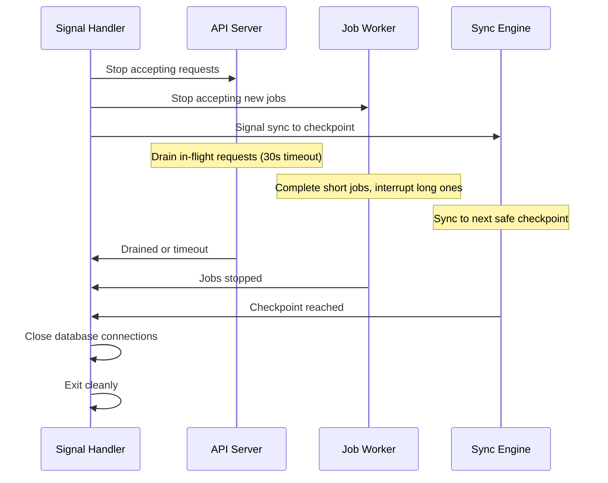

# Release 0.8.0: Operational Readiness

## Release Overview

This release completes Replica for production deployment. After this release, operators have full observability (metrics, tracing, structured logging), complete CLI for sync operations and administration, and proper graceful shutdown for container orchestration.

This is the final release before 1.0, focusing on operational excellence rather than new features.

## Prerequisites

- Release 0.7.0 (Sync Engine) completed

## Scope

### Included Tasks

| Task | Name | Description |
|------|------|-------------|
| 23 | Observability Stack | Prometheus metrics, OpenTelemetry tracing, zerolog |
| 27 | CLI Operations Commands | Sync, peer management, backup/restore |
| 30 | Graceful Shutdown | Signal handling, request draining, safe sync interruption |

### Not Included

- AI-assisted conflict resolution (post-1.0)
- Web admin UI (out of scope for 1.0)
- External IdP integration (post-1.0)

## Architecture Additions

```
internal/
├── observability/
│   ├── logging.go         # zerolog configuration
│   ├── metrics.go         # Prometheus metrics
│   ├── tracing.go         # OpenTelemetry tracing
│   └── correlation.go     # Correlation ID propagation
├── shutdown/
│   ├── handler.go         # Signal handling
│   ├── drainer.go         # Request draining
│   └── checkpoint.go      # Sync safe points
└── cmd/
    └── replica/
        ├── sync.go        # Sync commands
        ├── peer.go        # Peer management
        ├── content.go     # Content operations
        ├── backup.go      # Backup/restore
        ├── conflict.go    # Conflict management
        └── audit.go       # Audit queries
```

## Task Details

### Task 23: Observability Stack

**Objective**: Provide comprehensive operational visibility for distributed deployments

**Three Pillars of Observability**:

#### 1. Structured Logging (zerolog)

```go
import "github.com/rs/zerolog"

// Request logging with correlation
log.Info().
    Str("correlation_id", correlationID).
    Str("method", r.Method).
    Str("path", r.URL.Path).
    Str("user_id", userID.String()).
    Int("status", statusCode).
    Dur("duration", duration).
    Msg("request completed")
```

**Log Configuration**:
```yaml
logging:
  level: info          # debug, info, warn, error
  format: json         # json, console (for development)
  output: stdout       # stdout, file
  file:
    path: /var/log/replica/replica.log
    max_size_mb: 100
    max_backups: 5
```

**Correlation ID Propagation**:
- Generate correlation ID for each request
- Propagate to all service calls
- Include in sync operations across instances
- Log in all related entries

#### 2. Metrics (Prometheus)

```go
// Metrics endpoint: GET /metrics

var (
    requestsTotal = promauto.NewCounterVec(
        prometheus.CounterOpts{
            Name: "replica_http_requests_total",
            Help: "Total HTTP requests",
        },
        []string{"method", "path", "status"},
    )

    requestDuration = promauto.NewHistogramVec(
        prometheus.HistogramOpts{
            Name:    "replica_http_request_duration_seconds",
            Help:    "HTTP request duration",
            Buckets: prometheus.DefBuckets,
        },
        []string{"method", "path"},
    )

    syncOperations = promauto.NewCounterVec(
        prometheus.CounterOpts{
            Name: "replica_sync_operations_total",
            Help: "Total sync operations",
        },
        []string{"operation", "peer", "status"},
    )

    contentItems = promauto.NewGaugeVec(
        prometheus.GaugeOpts{
            Name: "replica_content_items",
            Help: "Number of content items",
        },
        []string{"content_type", "state"},
    )
)
```

**Key Metrics**:

| Metric | Type | Description |
|--------|------|-------------|
| `replica_http_requests_total` | Counter | Total HTTP requests by method/path/status |
| `replica_http_request_duration_seconds` | Histogram | Request latency distribution |
| `replica_sync_operations_total` | Counter | Sync operations by type/peer/status |
| `replica_sync_items_transferred` | Counter | Items synced |
| `replica_sync_bytes_transferred` | Counter | Bytes synced |
| `replica_conflicts_total` | Counter | Conflicts detected |
| `replica_conflicts_pending` | Gauge | Unresolved conflicts |
| `replica_content_items` | Gauge | Content items by type/state |
| `replica_assets_bytes` | Gauge | Total asset storage used |
| `replica_jobs_total` | Counter | Background jobs by type/status |
| `replica_jobs_pending` | Gauge | Jobs waiting in queue |
| `replica_cache_hits_total` | Counter | Cache hit count |
| `replica_cache_misses_total` | Counter | Cache miss count |

#### 3. Distributed Tracing (OpenTelemetry)

```go
import (
    "go.opentelemetry.io/otel"
    "go.opentelemetry.io/otel/trace"
)

func (s *SyncService) Pull(ctx context.Context, peerID uuid.UUID) (*SyncResult, error) {
    ctx, span := otel.Tracer("replica").Start(ctx, "sync.pull")
    defer span.End()

    span.SetAttributes(
        attribute.String("peer_id", peerID.String()),
        attribute.String("correlation_id", getCorrelationID(ctx)),
    )

    // Trace propagates to remote peer
    result, err := s.pullFromPeer(ctx, peerID)
    if err != nil {
        span.RecordError(err)
        span.SetStatus(codes.Error, err.Error())
    }

    span.SetAttributes(
        attribute.Int("items_synced", result.ItemsSynced),
        attribute.Int("conflicts", len(result.Conflicts)),
    )

    return result, err
}
```

**Tracing Configuration**:
```yaml
tracing:
  enabled: true
  exporter: otlp       # otlp, jaeger, zipkin
  endpoint: localhost:4317
  sample_rate: 1.0     # 1.0 = 100%, 0.1 = 10%
  service_name: replica
  instance_id: ${REPLICA_INSTANCE_ID}
```

**Cross-Instance Tracing**:
- Trace context propagated in sync requests
- Span links connect push/pull operations
- Full trace across multiple instances

**Deliverables**:
- zerolog structured logging
- Prometheus metrics endpoint
- OpenTelemetry tracing integration
- Correlation ID middleware
- Cross-instance trace propagation

**Acceptance Criteria**:
- [ ] All requests have structured logs
- [ ] Metrics endpoint returns Prometheus format
- [ ] Traces span sync operations across instances
- [ ] Correlation IDs link related log entries
- [ ] Sample rate is configurable

### Task 27: CLI Operations Commands

**Objective**: Provide complete command-line interface for sync and administration

**Command Structure**:
```
replica
├── (existing commands from 0.5.0)
│   ├── version
│   ├── init
│   ├── serve
│   ├── login
│   ├── logout
│   ├── config
│   └── completion
│
├── peer                    # Peer management
│   ├── list               # List registered peers
│   ├── add                # Register new peer
│   ├── remove             # Remove peer
│   ├── test               # Test peer connection
│   └── status             # Get peer sync status
│
├── sync                    # Sync operations
│   ├── pull               # Pull from peer
│   ├── push               # Push to peer
│   ├── status             # Show sync status
│   └── preview            # Dry run sync
│
├── conflict               # Conflict management
│   ├── list               # List unresolved conflicts
│   ├── show               # Show conflict details
│   ├── diff               # Show diff between versions
│   ├── resolve            # Resolve conflict
│   └── accept             # Accept local or remote
│
├── content                # Content operations
│   ├── list               # List content
│   ├── get                # Get content by ID
│   ├── create             # Create content
│   ├── update             # Update content
│   ├── delete             # Delete content
│   └── search             # Search content
│
├── backup                 # Backup operations
│   └── create             # Create backup archive
│
├── restore                # Restore operations
│   └── apply              # Restore from backup
│
└── audit                  # Audit log
    ├── list               # Query audit events
    └── export             # Export audit log
```

**Sync Commands**:
```bash
# Pull all published articles from production
$ replica sync pull production --type article --state published
Pulling from production (https://replica-prod.example.com)...
Items synced: 142
Conflicts detected: 3
Duration: 12.5s

# Push local changes to staging
$ replica sync push staging --since "2025-12-18"
Pushing to staging (https://replica-staging.example.com)...
Items pushed: 23
Duration: 4.2s

# Preview sync without applying
$ replica sync pull production --preview
Preview mode (no changes will be applied)
Would sync: 15 items
Would create conflicts: 2
```

**Peer Commands**:
```bash
# Add a new peer
$ replica peer add production \
    --url https://replica-prod.example.com \
    --client-id replica-staging \
    --client-secret file:///etc/replica/prod-secret
Peer 'production' registered successfully
Instance UUID: 01234567-89ab-cdef-...

# Test connection
$ replica peer test production
Connection successful
Remote version: 0.8.0
Last sync: 2025-12-18 10:30:00
```

**Conflict Commands**:
```bash
# List conflicts
$ replica conflict list
ID          CONTENT      TYPE      DETECTED
abc123...   My Article   article   2025-12-18 14:30

# Show diff
$ replica conflict diff abc123
--- local
+++ remote
@@ -1,3 +1,3 @@
 title: My Article
-body: Local version content
+body: Remote version content

# Resolve by accepting
$ replica conflict accept abc123 --version local
Conflict resolved: accepted local version
```

**Backup/Restore Commands**:
```bash
# Create backup
$ replica backup create --output backup-2025-12-19.tar.gz
Creating backup...
Including: 1,234 content items, 567 assets (metadata only)
Backup created: backup-2025-12-19.tar.gz (45 MB)

# Restore backup
$ replica restore apply --input backup-2025-12-19.tar.gz
Restoring from backup...
Content items restored: 1,234
Asset references restored: 567
Restore complete
```

**Output Formatting**:
```bash
# Human-readable (default)
$ replica content list --type article
ID                                    TITLE           STATE
01234567-89ab-cdef-...               Hello World     published
fedcba98-7654-3210-...               Draft Post      draft

# JSON for scripting
$ replica content list --type article --json
[{"id":"01234567-89ab-cdef-...","title":"Hello World","state":"published"},...]

# Quiet mode (IDs only)
$ replica content list --type article --quiet
01234567-89ab-cdef-...
fedcba98-7654-3210-...
```

**Deliverables**:
- Complete sync CLI commands
- Peer management commands
- Conflict resolution workflow
- Content CRUD commands
- Backup/restore commands
- Audit query commands
- Human, JSON, and quiet output modes

**Acceptance Criteria**:
- [ ] All sync operations available via CLI
- [ ] Peer management works end-to-end
- [ ] Conflict resolution flow is complete
- [ ] Backup creates valid archive
- [ ] Restore recovers from backup
- [ ] Output modes work correctly

### Task 30: Graceful Shutdown

**Objective**: Handle process termination without data corruption

**Signal Handling**:
```go
func (s *Server) Run(ctx context.Context) error {
    // Create shutdown context
    ctx, cancel := context.WithCancel(ctx)
    defer cancel()

    // Signal handler
    sigCh := make(chan os.Signal, 1)
    signal.Notify(sigCh, syscall.SIGTERM, syscall.SIGINT)

    go func() {
        sig := <-sigCh
        log.Info().Str("signal", sig.String()).Msg("shutdown signal received")
        cancel()
    }()

    // Start server and wait for shutdown
    return s.serve(ctx)
}
```

**Shutdown Sequence**:



**Configuration**:
```yaml
server:
  shutdown_timeout: 30s  # Max time to drain requests

jobs:
  shutdown_timeout: 10s  # Max time for job completion

sync:
  checkpoint_grace: 5s   # Time to reach safe checkpoint
```

**Sync Safe Points**:
- After each chunk of items is written
- Before starting new chunk
- Vector clock updated atomically with last chunk

**Request Draining**:
- Stop accepting new connections
- Wait for in-flight requests to complete
- Force close after timeout

**Job Handling**:
- Stop dequeuing new jobs
- Allow running jobs to complete (up to timeout)
- Jobs interrupted mid-execution will retry on restart

**Deliverables**:
- SIGTERM/SIGINT handling
- Request draining with timeout
- Job worker graceful stop
- Sync checkpoint mechanism
- Clean database connection closure
- Exit code indicating clean vs forced shutdown

**Acceptance Criteria**:
- [ ] SIGTERM triggers graceful shutdown
- [ ] In-flight requests complete within timeout
- [ ] Running jobs complete or checkpoint
- [ ] Sync operations reach safe point
- [ ] Database connections close cleanly
- [ ] Kubernetes health checks work with shutdown

## Kubernetes Integration

**Health and Readiness**:
```yaml
# Kubernetes deployment snippet
containers:
  - name: replica
    livenessProbe:
      httpGet:
        path: /health
        port: 8080
      initialDelaySeconds: 5
      periodSeconds: 10
    readinessProbe:
      httpGet:
        path: /health
        port: 8080
      initialDelaySeconds: 5
      periodSeconds: 5
    lifecycle:
      preStop:
        exec:
          command: ["sleep", "5"]  # Allow LB to drain
```

**Graceful Termination**:
```yaml
spec:
  terminationGracePeriodSeconds: 60  # Matches our 30s + buffer
```

## Dependencies

| Dependency | From Release |
|------------|--------------|
| Sync engine | 0.7.0 |
| Background jobs | 0.6.0 |
| JSON:API server | 0.5.0 |
| CLI core | 0.5.0 |

## Success Criteria for 0.8.0

1. **Observability**: Logs, metrics, and traces provide full operational visibility
2. **CLI Completeness**: All operations achievable via command line
3. **Graceful Shutdown**: Clean termination with no data loss
4. **Production Ready**: Suitable for deployment in container orchestration

## Release Checklist

- [ ] All tasks completed and tested
- [ ] Prometheus metrics verified with Grafana
- [ ] Tracing verified with Jaeger/similar
- [ ] CLI tested on Linux, macOS, Windows
- [ ] Graceful shutdown tested in Kubernetes
- [ ] Performance benchmarks documented
- [ ] Security review completed
- [ ] Documentation complete
- [ ] CI pipeline green
- [ ] Release notes drafted
- [ ] Git tag created: v0.8.0

## Path to 1.0

After 0.8.0, the following activities lead to 1.0:

1. **Comprehensive Testing**: End-to-end scenarios across multiple instances
2. **Performance Optimization**: Profile and optimize hot paths
3. **Security Hardening**: Penetration testing, dependency audit
4. **Documentation**: Complete user and operator documentation
5. **Beta Testing**: Deploy to early adopters for feedback
6. **Bug Fixes**: Address issues found during beta
7. **Release Candidate**: Final validation before 1.0 tag
