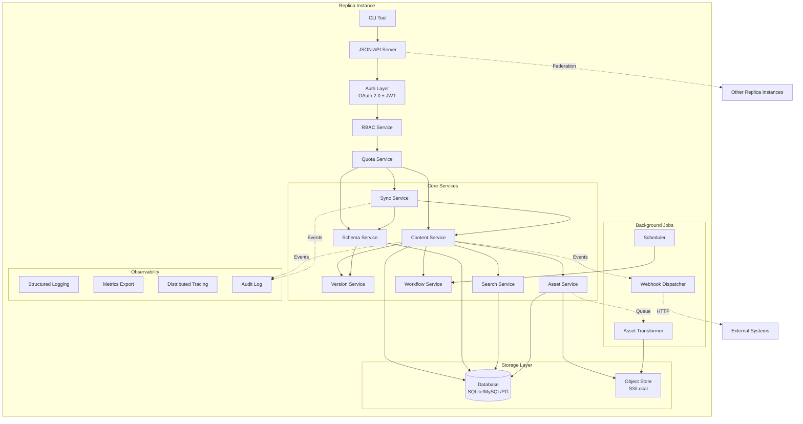
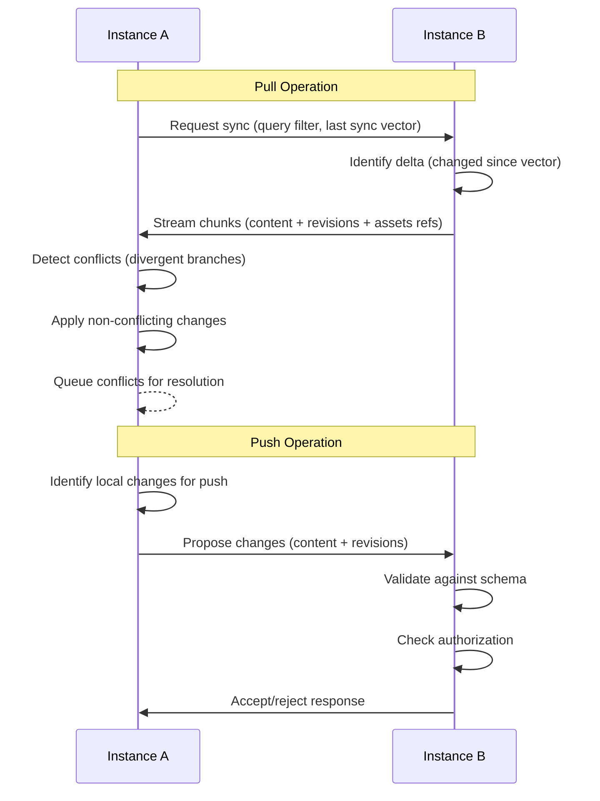
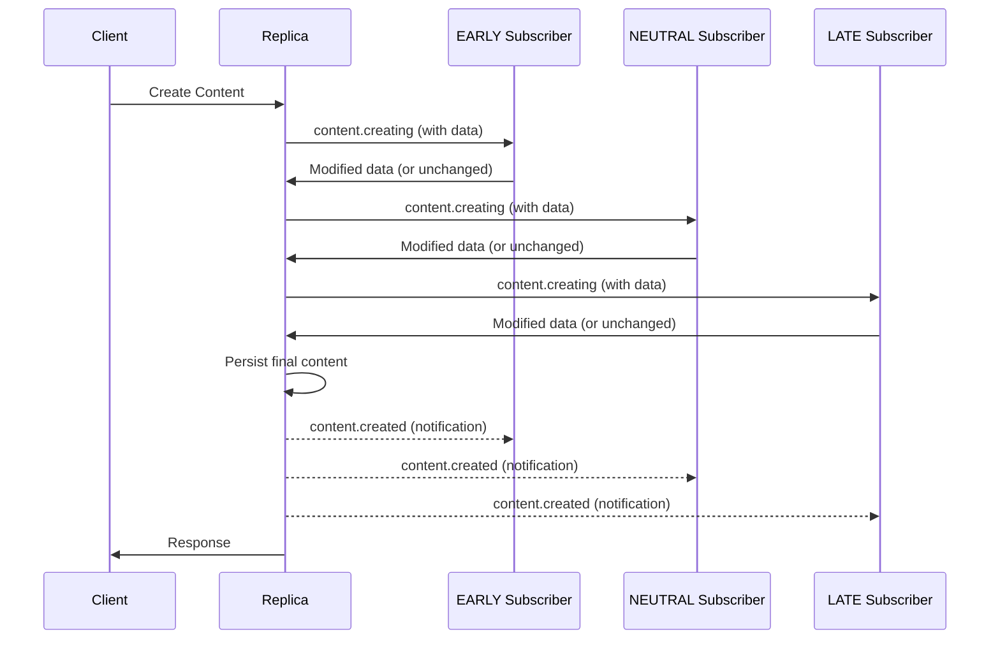
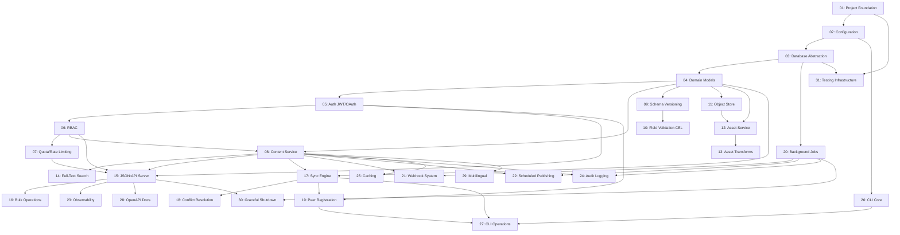

# Plan: Replica 1.0 - Distributed Content Management System

## Original Work Order

> Define the scope and implementation for a 1.0 release of "Replica", a golang CMS focused on a distributed content model. The CMS allows for each instance to push or pull content from other Replica instances. This implies many features, such as having UUIDs for all objects, metadata over APIs to expose content type definitions, and versions not just for content but for the content schema as well. For example, a user should be able to pull content updates for some or all content from a production instance to a test instance. All schema updates should ship with upgrade and downgrade paths over the API, so consuming sites can migrate content to match different schemas. This should also enable Blue / Green deployments of equal production environments, as well as larger content distribution networks between independent sites.

## Plan Clarifications

| Question | Answer |
|----------|--------|
| Authentication model for inter-instance communication? | OAuth 2.0/JWT only; token-based authentication with expiration for all environments |
| Content conflict resolution strategy? | Version branching with manual or AI-assisted merge resolution |
| Content types for 1.0? | Full CMS: structured content, media, users, permissions. Binary files via pluggable object stores (S3 default, local for dev) |
| Schema migration approval? | Auto-migrate unless data loss possible, then require explicit approval |
| Sync operation model? | Bidirectional push/pull between peers |
| Sync granularity? | Query-based supporting full instance, content type, or individual item selection |
| Admin interface? | API-only with CLI tool for administration |
| Observability? | Basic logging, Prometheus/OpenTelemetry metrics, distributed tracing |
| Version sync depth? | Full history by default, configurable pruning by age or revision count |
| Database migrations? | golang-migrate for multi-database support |
| Large content sync? | Delta sync with chunked transfers and resume capability |
| Content relationship sync? | Automatically include referenced content (dependencies) in sync operations |
| User/permission model? | RBAC with custom roles and granular permissions |
| Binary asset versioning? | Full version history for all binary files, enabling rollback |
| Field type complexity? | Rich types: string, number, boolean, date, reference, media, plus rich text, JSON blob, geolocation, computed fields |
| Circular reference handling? | Detect cycles and include all items in the cycle in one sync batch |
| RBAC sync scope? | Role definitions sync between instances, but user assignments are instance-local |
| Rate limiting? | Storage and API quotas per instance/user with enforcement |
| Computed fields calculation? | On-write: calculated when content is saved, stored and indexable |
| Content deletion? | Configurable: soft delete by default, optional hard delete after retention period |
| Workflow states? | Custom configurable workflow states per content type (draft, review, published, etc.) |
| Instance identification? | UUID generated at first boot + admin-configured friendly name mapping to UUID |
| Full-text search? | Database-native search (PostgreSQL FTS, SQLite FTS5, MySQL FULLTEXT) |
| Scheduled publishing? | Content can be scheduled for future publication |
| External integrations? | Configurable webhooks triggered on content and sync events |
| Multilingual support? | Content items can have translations linked by UUID |
| Concurrent edit handling? | Optimistic locking with version checks; optional AI-assisted conflict resolution |
| Asset transformations? | Background variant generation with on-demand fallback for missing variants |
| API pagination? | Cursor-based pagination for efficient deep pagination |
| Field validation? | Expression language (CEL or similar) for complex validation rules |
| Configuration format? | YAML configuration files with environment variable overrides |
| Sync failure recovery? | Idempotent retry; partial syncs are consistent, dependencies written in order, co-dependencies atomic |
| Audit logging? | Immutable audit log of all content changes, access, and sync operations |
| New instance bootstrap? | Start empty; pull content from peers as needed |
| Migration tooling? | API only for data movement; no file-based import in 1.0 |
| API versioning? | URL path versioning (e.g., /v1/content) |
| Health checks? | Simple /health endpoint for container orchestration |
| TLS handling? | Terminate at reverse proxy/load balancer; Replica speaks HTTP internally |
| Deployment artifacts? | Static binary plus official Docker image |
| API documentation? | Auto-generated OpenAPI/Swagger specification from code |
| Content type management? | API only; content types created and modified exclusively through API |
| Graceful shutdown? | Interrupt syncs at next safe point; rely on idempotent retry for resume |
| MVP scope for 1.0? | All 41 architectural components are required for the core distributed CMS vision |
| Local user authentication? | CLI creates initial admin user; subsequent users created via API |
| Testing strategy? | Unit tests with code coverage, functional tests for CLI, mutation testing with gremlins |
| Instance bootstrap? | CLI init command creates admin user and optional starter content types |
| Starter content types? | Optional templates (Article, Page, Media) available via CLI init |
| Mutation testing framework? | gremlins for mutation testing |
| Extension model? | HTTP webhook-based; subscribers can intercept and modify content during CRUD operations |
| Webhook priority? | Subscribers specify advisory priority: EARLY, NEUTRAL, or LATE for call ordering |
| Webhook subscription management? | API only; subscriptions created and managed via REST endpoints |
| Webhook failure handling? | Configurable per-subscriber: 'required' (abort on fail) or 'optional' (skip on fail) |
| CLI authentication? | Login flow; CLI has 'login' command that stores JWT token locally |
| Peer instance configuration? | API registration; peers registered via API with URL, name, and credentials |
| Background job processing? | Database queue; jobs stored in database; single worker per instance (no distributed locking needed) |
| Content caching? | In-memory cache per instance; not shared between instances |
| Schema versioning model? | Semantic versioning (MAJOR.MINOR.PATCH) for content type schemas |
| Schema MAJOR version bump? | Breaking changes: field removal, field type changes, format changes (string to array) |
| Schema MINOR version bump? | Non-breaking additions: new optional fields, new enum values |
| Schema PATCH version bump? | Metadata changes, validation relaxation, default value changes, computed field bug fixes |
| Client schema version selection? | Clients can request content in a specific schema version; content transformed to match |
| Minimum schema version? | Admins can set minimum supported version per content type to deprecate old versions |
| Schema version discovery? | API endpoint to list all supported schema versions with changelogs |
| Federation trust model? | Git-like: some trust required (content quality not guaranteed), but pulling never causes irreversible data loss or executes code |
| Cross-instance protocol? | Application-level HTTPS protocol (not database replication); each instance controls its own database |
| Pulled content safety? | Content is data only; no executable code; all changes create new revisions (reversible) |
| OAuth identity provider? | Built-in IdP only; Replica issues its own JWTs; no external IdP integration in 1.0 |
| Rich text format? | Both HTML and Markdown supported; configurable per field; both sanitized appropriately |
| License model? | AGPL-3.0; copyleft license requiring source sharing for deployed services |
| Image processing library? | vipsgen (cshum/vipsgen); Go bindings for libvips; high performance with C dependency |
| Computed field expressions? | CEL expressions only; same language as field validation for consistency |
| CLI shell completions? | Yes; CLI includes 'completion' subcommand for bash, zsh, and fish |
| Content pruning trigger? | Background job on schedule; periodic job runs pruning based on configured retention policies |
| Sync protocol versioning? | Tied to API version; sync protocol version matches API version (/v1 API uses sync v1) |
| Multi-instance clustering? | Single writer only; one Replica instance per database; scale via federation instead |
| Webhook HMAC algorithm? | HMAC-SHA256; standard choice with good security/performance balance |
| Background job retry policy? | Configurable per job type; different retry policies for webhooks, pruning, etc. |
| Audit log export? | Webhook notifications; real-time audit events sent to configured webhook endpoints |
| CLI config directory? | XDG compliant; ~/.config/replica on Linux; platform-appropriate on macOS/Windows |
| Custom metadata fields? | Schema-defined only; all fields must be in schema; use JSON blob field for flexible data |
| UUID format? | UUIDv7 (time-ordered); better for database indexing and time-based queries |
| Password hashing algorithm? | argon2id; modern memory-hard algorithm; winner of Password Hashing Competition |
| JSON:API sparse fieldsets? | Yes; clients can request only specific fields to reduce payload size |
| Webhook timeout default? | 30 seconds; generous timeout for complex subscriber processing; configurable per subscriber |
| Asset file size limit? | No default limit; limited only by infrastructure; operator configures if needed |
| Geolocation field format? | GeoJSON Point format; standard format compatible with mapping libraries |
| JWT signing algorithm? | RS256 (asymmetric); public key can be shared for verification; better for federation |
| Default pagination page size? | 100 items; efficient for data-heavy clients; configurable per request |
| Content type naming convention? | camelCase only; consistent with JSON conventions |
| Bulk operations? | Yes; support bulk create/update/delete in single request; JSON:API extension |
| Docker image base? | Alpine + libvips; small image size (~50MB) with image processing support |
| Structured logging library? | zerolog; high performance; zero allocations; popular in Go community |
| JSON:API library? | google/jsonapi; mature library for marshaling/unmarshaling JSON:API format |
| JWT token expiration? | 1 hour access token / 30 day refresh token; configurable per instance |
| Rate limiting algorithm? | Sliding window; accurate rate limiting; prevents bursts at window boundaries |
| HTML sanitization library? | bluemonday; Go-native; fast; policy-based sanitization |
| Minimum Go version? | Go 1.25+; current stable release (1.25.5 as of December 2025) |
| Markdown rendering library? | goldmark; CommonMark compliant; extensible; most popular Go Markdown parser |
| CLI output format default? | Human-readable by default; --json flag for JSON output (script-friendly) |
| Sync chunk size default? | 100 items per chunk; smaller chunks for better progress tracking and reliability |
| Graceful shutdown timeout? | 30 seconds; standard timeout for in-flight requests before forced shutdown |
| Maximum fields per content type? | No limit; schema designer decides; performance responsibility on user |
| Backup/restore strategy? | CLI commands `replica backup` and `replica restore` for convenience; exports database and asset metadata |
| AI conflict resolution interface? | Defer to post-1.0; manual resolution implemented first; AI interface is future enhancement |
| Bulk request schema versions? | Per-item meta field; header sets default, items override via `meta.schemaVersion` in payload |
| Array field types? | Yes; fields can be arrays of basic types (string[], number[], reference[]) |
| Date/datetime timezone handling? | Store with timezone; preserve original timezone offset with each date value |
| Maximum request body size? | No default limit; limited only by infrastructure; operator configures if needed |
| Object store library? | gocloud.dev/blob; portable blob storage API supporting S3, GCS, Azure, local filesystem, and in-memory (for testing) |
| Concurrency model? | Goroutines with semaphore pattern for bounded concurrency where needed (external HTTP, object store) |
| Asset revision tracking? | Yes; assets track which content revision added/changed them; sync only transfers assets newer than last sync point |
| Sync state tracking? | Per-peer vector clock; store last-synced vector clock per peer (like Git's remote tracking refs); no replication IDs needed |

## Executive Summary

Replica is a distributed Content Management System built in Go that enables bidirectional content synchronization between independent instances. The system addresses the need for flexible content distribution across environments (production-to-staging, blue-green deployments) and organizations (content distribution networks between partner sites).

The architectural approach centers on treating content and schema as versioned, UUID-identified entities that can flow between instances while maintaining integrity and traceability. Each instance operates autonomously but can federate with peers through a standardized JSON:API interface. The version branching model for conflict resolution, combined with OAuth 2.0/JWT authentication, enables both simple internal deployments and complex multi-organization federations.

Key differentiators include schema version management with automatic upgrade/downgrade paths, query-based selective sync, and version-branching conflict resolution with manual merge (AI-assisted resolution planned for post-1.0). The system supports multiple database backends (SQLite, MySQL/MariaDB, PostgreSQL) and delegates binary asset storage to pluggable object stores, optimizing for the performance characteristics of distributed storage systems.

## Context

### Current State vs Target State

| Current State | Target State | Why? |
|---------------|--------------|------|
| No codebase exists | Fully functional distributed CMS | Greenfield implementation of core vision |
| No content model | UUID-based content with full version history | Enable unique identification and history tracking across instances |
| No schema management | Versioned schemas with upgrade/downgrade migrations | Allow consuming sites to adapt content to different schema versions |
| No sync capability | Bidirectional delta sync with chunked transfers | Enable efficient content distribution between instances |
| No conflict handling | Version branching with manual/AI merge | Support concurrent modifications across distributed instances |
| No multi-database support | SQLite, MySQL/MariaDB, PostgreSQL backends | Support diverse deployment environments |
| No observability | Logging, metrics, distributed tracing | Enable operational visibility in distributed deployments |
| No CLI tooling | Full CLI for administration and sync operations | Provide operators with efficient management interface |

### Background

Distributed content management presents unique challenges that traditional CMS architectures don't address. Organizations need to:

1. **Replicate content across environments** - Pull production content to staging/test without manual export/import
2. **Deploy with zero downtime** - Blue/green deployments require synchronized content across parallel production environments
3. **Federate content across organizations** - Content distribution networks where independent sites share subsets of content

The JSON:API specification provides a standardized interface for content operations. Combined with UUID-based identification and vector clock versioning, this enables reliable content synchronization without central coordination.

The pluggable object store approach for binary assets acknowledges that file distribution has fundamentally different performance characteristics than metadata synchronization. S3-compatible storage provides the scalability needed for media-heavy deployments while local storage supports development workflows.

## Architectural Approach



### Core Data Model
**Objective**: Establish UUID-based entities with comprehensive version tracking that enables distributed synchronization

All entities use UUIDv7 (time-ordered) as primary identifiers, enabling conflict-free creation across instances with efficient database indexing. The content model separates:

- **Content Items**: The actual content data with UUID, content type reference, and field values
- **Content Types**: Schema definitions describing fields, validation rules, and relationships
- **Revisions**: Immutable snapshots of content state with parent revision references forming a DAG
- **Schema Versions**: Versioned content type definitions with migration paths
- **Assets**: Binary files with full version history, stored in object stores with metadata in the database

**Supported Field Types:**
- **Basic**: String, number (integer/float), boolean, date/datetime (stored with timezone)
- **Arrays**: Arrays of basic types (string[], number[], boolean[], date[])
- **References**: Links to other content items (with referential integrity); supports reference[]
- **Media**: References to versioned binary assets; supports media[]
- **Rich**: Rich text (configurable per field as HTML or Markdown; both sanitized appropriately), JSON blob (schema-validated)
- **Specialized**: Geolocation (GeoJSON Point format), computed fields (CEL expressions calculated on-write, stored and indexable)

Vector clocks accompany revisions to enable proper ordering and conflict detection without centralized coordination. Each instance maintains its logical clock, incremented on local modifications.

### Schema Version Management
**Objective**: Enable content type evolution with semantic versioning and client-selectable schema versions

Content types evolve over time. Replica treats schema changes as first-class versioned entities using semantic versioning (MAJOR.MINOR.PATCH):

**Semantic Versioning Rules:**
- **MAJOR** (breaking): Field removal, field type changes, format changes (e.g., string → array)
- **MINOR** (additive): New optional fields, new enum values, new validation options
- **PATCH** (metadata): Field descriptions, relaxed validation rules, default value changes, computed field bug fixes

**Version Management:**
- Each content type maintains a version history with all schema versions
- Schema versions include structured migration definitions (not raw SQL)
- Migrations specify field additions, removals, transformations, and validation changes
- Upgrade and downgrade paths enable bidirectional content transformation between versions

**Client Schema Version Selection:**
- API consumers specify desired schema version via header or query parameter (e.g., `Accept: application/vnd.api+json; schema-version=1.2`)
- Content is automatically transformed to match the requested schema version
- Webhook subscribers can specify which schema version they want to receive
- If no version specified, the latest version is returned
- **Bulk requests**: Header sets default; individual items can override via `meta.schemaVersion` in payload

**Minimum Supported Version:**
- Admins can set a minimum supported schema version per content type
- Requests for versions below the minimum return an error with upgrade guidance
- Enables deprecation of old schema versions over time

**Schema Version Discovery:**
- `GET /content-types/{type}/versions` returns all supported schema versions
- Each version entry includes: version number, changelog, field differences, deprecation status
- Clients can query to understand available versions before making requests

Migration definitions use a declarative format describing the transformation, enabling the system to generate appropriate SQL for each database backend.

### Content Type Management
**Objective**: Provide API-driven content type definition and evolution

Content types are managed exclusively through the API:

- **API Operations**: Create, update, delete content types via REST endpoints
- **Naming Convention**: Content type and field names must use camelCase (e.g., `blogPost`, `publishDate`)
- **No Config Files**: Content types not defined in YAML; schema is data, not configuration
- **Sync as Content**: Content type definitions sync between instances like any other content
- **Schema Validation**: API validates content type changes; prevents invalid field configurations
- **Migration Generation**: Schema changes automatically generate migration definitions

This approach enables content type management through the same sync mechanisms as content itself.

### Authentication and Authorization
**Objective**: Provide secure, standards-based authentication for all environments

OAuth 2.0/JWT authentication with built-in identity provider:

- **Built-in IdP**: Replica issues its own JWTs; no external IdP integration in 1.0
- **JWT Signing**: RS256 (asymmetric); public key can be shared for token verification across instances
- **Token-Based Auth**: All authentication uses JWT tokens (1-hour access, 30-day refresh by default; configurable)
- **OAuth 2.0 Flows**: Support for client credentials (service-to-service) and authorization code (user authentication) flows
- **Scoped Permissions**: Tokens carry permission scopes for fine-grained access control
- **Token Refresh**: Refresh tokens enable long-lived sessions without storing credentials
- **Instance-to-Instance**: Peer instances authenticate using OAuth client credentials

Authorization operates at multiple levels:
- Instance-level: Which remote instances can connect
- Content type-level: Which content types can be synced
- Operation-level: Push, pull, or both

### Role-Based Access Control (RBAC)
**Objective**: Provide granular permission management for local content operations

The RBAC system manages user access to content and operations:

- **Custom Roles**: Define roles with specific permission sets (beyond basic admin/editor/viewer)
- **Granular Permissions**: Permissions scoped to content types, operations (create/read/update/delete), and field-level access
- **Role Definitions Sync**: Role templates can sync between instances for consistency
- **Instance-Local Assignments**: User-to-role assignments remain instance-specific (not synced)

This separation allows organizations to maintain consistent role definitions across environments while managing users independently per instance.

### Quota and Rate Limiting
**Objective**: Protect system resources and enforce usage limits

The quota system enforces limits at multiple levels:

- **API Rate Limits**: Per-client request limits using sliding window algorithm to prevent abuse
- **Storage Quotas**: Limits on content items, revisions, and asset storage per user or instance
- **Sync Quotas**: Limits on sync operation frequency and data volume
- **Enforcement**: Requests exceeding quotas receive HTTP 429 with Retry-After header

### Sync Engine
**Objective**: Enable efficient bidirectional content synchronization with conflict detection



Sync operations support:
- **Query-based selection**: Filter by content type, individual UUIDs, tags, date ranges, or custom queries
- **Delta sync**: Only transfer content modified since last synchronization
- **Chunked transfer**: Large sync operations broken into resumable chunks (100 items per chunk by default)
- **Bidirectional flow**: Both push and pull supported between any connected instances
- **Dependency resolution**: Automatically include referenced content items in sync operations
- **Circular reference handling**: Detect reference cycles and include all items in the cycle as a single atomic batch
- **Schema version transformation**: Content automatically transformed to match destination instance's schema version during sync

**Per-Peer Sync State (Git-like model):**
- Each peer has a stored "last synced vector clock" (like Git's `refs/remotes/origin/main`)
- On sync, compare local vector clock with stored peer clock to identify changes
- After successful sync, update stored peer clock to current state
- No CouchDB-style replication IDs needed; state is per-peer, not per-filter
- Filtered syncs use the same peer clock; filter just limits what's transferred

The sync protocol transmits content metadata and revision history. Binary assets are referenced by their object store URLs; the receiving instance can fetch assets from the origin's object store or trigger replication to its own store.

**Asset Sync Optimization**: Assets track their revision origin; during sync, only assets added/changed since the last sync point are transferred, avoiding redundant asset transfers.

### Federation Trust Model
**Objective**: Enable safe content sharing between independent, potentially untrusted instances

Replica follows a **Git-like federation model** where sync occurs at the application level, not the database level:

```
Instance A (Publisher)                 Instance B (Consumer)
┌─────────────────────┐               ┌─────────────────────┐
│    Replica API      │◄── HTTPS ────►│    Replica API      │
│  (Controls access)  │  (Your sync   │  (Validates input)  │
└──────────┬──────────┘   protocol)   └──────────┬──────────┘
           │                                     │
           ▼                                     ▼
┌─────────────────────┐               ┌─────────────────────┐
│      Database       │               │      Database       │
│   (Not exposed)     │               │   (Not exposed)     │
└─────────────────────┘               └─────────────────────┘
```

**Trust Assumptions (Like Git):**
- Pulling content from a remote instance requires some trust in the content quality
- Remote content may be poorly written, outdated, or inappropriate
- The receiving instance decides what to pull and can reject or filter content
- Content authorship and origin are tracked for accountability

**Safety Guarantees (Unlike Arbitrary Code):**
- **No code execution**: Pulled content is pure data; no executable code, templates, or scripts
- **Reversible changes**: All incoming content creates new revisions; nothing is overwritten destructively
- **No data loss**: Existing local content is preserved; conflicts create branches, not overwrites
- **Schema validation**: Incoming content must validate against local schema before acceptance
- **Sandboxed fields**: Rich text and JSON fields are sanitized; no script injection

**What Can Go Wrong (Accepted Risks):**
- Pulling low-quality or incorrect content (user's judgment required)
- Storage consumption from large syncs (quotas can limit)
- Conflicts requiring manual resolution (expected behavior)

**What Cannot Happen:**
- Remote instance cannot execute code on local instance
- Remote instance cannot delete local content without creating tombstone
- Remote instance cannot bypass local RBAC or validation
- Sync cannot cause unrecoverable data loss

This model ensures that federation remains safe even when syncing with instances controlled by other organizations.

### Conflict Resolution
**Objective**: Handle concurrent modifications across distributed instances gracefully

When the same content is modified on multiple instances before sync:

1. **Detection**: Vector clock comparison identifies divergent revision branches
2. **Branching**: Both versions are preserved as branches of the revision DAG
3. **Resolution options**:
   - Manual: Present both versions to user for merge decision
   - AI-assisted: Invoke configured AI service to propose merge
   - Automated rules: Apply configured merge strategies per content type

Resolved conflicts create a new revision with both branches as parents, preserving full history.

### Object Store Integration
**Objective**: Handle binary assets efficiently with pluggable storage backends and full version history

Binary files (media, documents) are stored in object stores rather than the database, using **gocloud.dev/blob** for portable storage abstraction:

- **AWS S3**: Production backend via `s3://bucket-name` URL scheme
- **Google Cloud Storage**: Production backend via `gs://bucket-name` URL scheme
- **Azure Blob Storage**: Production backend via `azblob://container` URL scheme
- **Local filesystem**: Development backend via `file:///path` URL scheme
- **In-memory**: Testing backend via `mem://` URL scheme (no external dependencies)

**Asset Versioning:**
- Each asset maintains full version history similar to content items
- Asset versions are immutable; updates create new versions
- Version history enables rollback to previous asset states
- Pruning policies can limit retained versions by count or age
- **Revision Origin Tracking**: Each asset records which content revision added/changed it (similar to CouchDB's `revpos`)

The content database stores object store references (bucket, key, version, metadata). Asset sync between instances can operate in multiple modes:
- Reference-only: Receiving instance accesses assets from origin's store
- Copy-on-sync: Assets replicated to receiving instance's store
- Lazy-copy: Assets copied on first local access

### CLI Tool
**Objective**: Provide operators with efficient command-line administration

The CLI tool provides administrative operations:
- Instance configuration and peer registration
- Sync operations (push/pull with query filters)
- Schema management (list versions, preview migrations)
- Conflict resolution queue management
- Content pruning operations
- Health and status checks

**Authentication:**
- **Login Command**: `replica login` authenticates with username/password and stores JWT token locally
- **Token Storage**: JWT stored in XDG-compliant config directory (~/.config/replica on Linux; platform-appropriate on macOS/Windows)
- **Token Refresh**: Automatic refresh when token approaches expiration
- **Logout**: `replica logout` removes stored credentials

**Shell Integration:**
- **Completion Command**: `replica completion [bash|zsh|fish]` generates shell completion scripts
- **Installation**: Output can be sourced directly or saved to appropriate completion directory

**Output Formatting:**
- **Default**: Human-readable formatted output for interactive use
- **JSON Mode**: `--json` flag outputs structured JSON for scripting integration
- **Quiet Mode**: `--quiet` flag suppresses non-essential output

### Observability Stack
**Objective**: Enable operational visibility across distributed deployments

Three-pillar observability:

- **Structured Logging**: JSON-formatted logs with correlation IDs that span cross-instance operations
- **Metrics**: Prometheus-compatible metrics exposing sync operations, latency, error rates, queue depths
- **Distributed Tracing**: OpenTelemetry integration for tracing requests across instance boundaries

Correlation IDs propagate through sync operations, enabling operators to trace a content item's journey across multiple instances.

### Database Abstraction
**Objective**: Support multiple database backends for diverse deployment needs

Using golang-migrate with database-agnostic migration definitions:

- **SQLite**: Default for development and small deployments
- **MySQL/MariaDB**: Production deployments with existing MySQL infrastructure
- **PostgreSQL**: Production deployments preferring PostgreSQL
- **Single Writer Model**: One Replica instance per database; scale horizontally via federation, not database sharing

The data access layer abstracts database-specific SQL, with migrations generating appropriate DDL for each backend.

### Concurrency Model
**Objective**: Maximize CPU utilization through idiomatic Go concurrency patterns

Replica uses goroutines with the Go scheduler, applying semaphore-based limits only where external systems require it:

**HTTP Request Handling:**
- Go's `net/http` spawns a goroutine per incoming request automatically
- All API endpoints handle concurrent requests without explicit coordination
- Context propagation enables request-scoped cancellation and timeouts

**Background Jobs:**
- Each job spawns a goroutine; Go scheduler handles CPU multiplexing
- Semaphore limits applied only for external I/O (webhooks, object store)
- No complex worker pool infrastructure needed

**Semaphore Pattern for External Systems:**
```go
// Limit concurrent external HTTP calls
sem := make(chan struct{}, maxConcurrent)
for _, webhook := range webhooks {
    sem <- struct{}{}  // acquire slot
    go func(w Webhook) {
        defer func() { <-sem }()  // release slot
        callWebhook(w)
    }(webhook)
}
```

**Where Semaphores Are Used:**
- **Webhook delivery**: Limit concurrent outbound HTTP calls (default: 10)
- **Object store operations**: Limit concurrent S3/GCS calls (default: 10)
- **Sync asset fetching**: Limit concurrent asset downloads (default: 5)

**Where Unbounded Goroutines Are Fine:**
- Database queries (driver connection pool provides limit)
- CPU-bound work (Go scheduler limits to GOMAXPROCS)
- Internal processing (no external system to overwhelm)

**Resource Management:**
- All goroutines respect context cancellation for graceful shutdown
- Semaphores release on context cancellation
- Bounded concurrency prevents overwhelming external systems

### Workflow and Publishing
**Objective**: Support configurable content lifecycle states with scheduled publishing

Content items move through configurable workflow states:

- **Custom States**: Each content type defines its own workflow states (e.g., draft → review → published → archived)
- **State Transitions**: Configurable rules for valid state transitions and required permissions
- **Scheduled Publishing**: Content can be scheduled to transition states at specific times (e.g., publish at midnight)
- **Sync Filtering**: Sync operations can filter by workflow state (e.g., only sync published content to production)

A background scheduler processes pending state transitions.

### Content Deletion
**Objective**: Handle content removal with configurable retention and sync propagation

Deletion operates in two modes:

- **Soft Delete**: Content marked as deleted but retained; deletion syncs as a tombstone marker
- **Hard Delete**: Permanent removal after configurable retention period
- **Cascade Behavior**: Configurable handling of referenced content (block, cascade, or nullify references)

Tombstones ensure deletions propagate correctly across instances, with configurable retention before permanent removal.

### Full-Text Search
**Objective**: Enable content discovery through database-native full-text search

Search leverages each database's native capabilities:

- **PostgreSQL**: Full-text search with tsvector/tsquery, GIN indexes
- **SQLite**: FTS5 virtual tables with porter stemmer
- **MySQL/MariaDB**: FULLTEXT indexes with natural language mode

The search abstraction provides a unified query interface while using database-specific implementations for optimal performance. Indexed fields are configurable per content type.

### Instance Identity
**Objective**: Uniquely identify instances for federation and sync tracking

Each instance maintains:

- **Instance UUID**: Generated at first boot, immutable, used for vector clocks and sync tracking
- **Instance Name**: Admin-configured friendly identifier (e.g., "production-us-east")
- **Name-to-UUID Mapping**: Remote instances reference by name; resolved to UUID for operations

This allows operators to use meaningful names while maintaining stable UUIDs for distributed system coordination.

### Peer Registration
**Objective**: Enable federation between Replica instances

Peer instances are registered via API:

- **Registration Endpoint**: POST to register new peer with URL, friendly name, and credentials
- **Credential Types**: OAuth client credentials (client ID and secret) for the remote instance
- **Health Verification**: Optional connectivity check during registration
- **Sync Permissions**: Configure which content types can sync with this peer, and in which direction
- **Peer Management**: List, update, disable, or remove peers via API

Peers are stored in the database and used for federation with other Replica instances.

### Background Job Queue
**Objective**: Process asynchronous tasks reliably within a single instance

Jobs are queued in the database for reliable processing:

- **Database-Backed Queue**: Jobs stored as database records; survives instance restarts
- **Goroutine Per Job**: Each job spawns a goroutine; Go scheduler handles parallelism
- **Job Types**: Scheduled publishing, webhook delivery, asset transformation, pruning, audit streaming
- **Semaphore Limits**: External I/O jobs (webhooks, S3) use semaphores to limit concurrency
- **Retry Logic**: Configurable per job type with exponential backoff; dead-letter after max attempts
- **Retry Configuration**: Different policies for different jobs (e.g., webhooks may retry more aggressively than pruning)
- **No Distributed Locking**: Single-writer model means no coordination needed between instances

This simple approach relies on Go's scheduler for CPU-bound work and semaphores only where external systems require bounded concurrency.

### Content Caching
**Objective**: Improve read performance for frequently accessed content

In-memory caching per instance:

- **Cache Scope**: Per-instance cache; not shared between instances
- **Cache Strategy**: LRU eviction with configurable size limits
- **Invalidation**: Cache invalidated on local writes and incoming sync
- **Cache Bypass**: API parameter to bypass cache for fresh data
- **Metrics**: Cache hit/miss rates exposed via metrics endpoint

Caching is optional and can be disabled for memory-constrained deployments.

### Webhook Extension System
**Objective**: Enable external integrations and content modification through HTTP-based extension points

The webhook system serves as the primary extension model, allowing external services to intercept and modify content during CRUD operations:

**Extension Model:**
- **Interceptor Pattern**: Webhooks are called during content operations, not just after
- **Data Modification**: Subscribers can inspect and modify content data in their response
- **Synchronous Flow**: CRUD operations wait for webhook responses before completing
- **Timeout Handling**: Default 30-second timeout per subscriber; configurable per subscription

**Event Types:**
- **Content Events**: `content.creating`, `content.created`, `content.updating`, `content.updated`, `content.deleting`, `content.deleted`
- **Workflow Events**: `workflow.transitioning`, `workflow.transitioned`
- **Sync Events**: `sync.started`, `sync.completed`, `sync.conflict_detected`
- **Schema Events**: `schema.updating`, `schema.updated`

**Subscriber Priority:**
Subscribers specify an advisory priority when registering, influencing call order:
- **EARLY**: Called first; typically for validation, enrichment, or transformation
- **NEUTRAL**: Called in middle; default priority for general processing
- **LATE**: Called last; typically for logging, analytics, or final modifications

Priority is advisory; the system orders subscribers by priority but doesn't guarantee strict ordering within the same priority level.

**Webhook Configuration:**
- **API Management**: Subscriptions created, updated, deleted via REST endpoints
- **Multiple Endpoints**: Multiple subscribers per event type
- **Selective Subscription**: Subscribe to specific content types or all content
- **Schema Version Selection**: Subscribers specify which schema version to receive (e.g., `1.2` or `1.*` for latest minor)
- **Failure Mode**: Per-subscriber setting - `required` (abort operation on failure) or `optional` (skip and continue)
- **Payload Signing**: HMAC signatures for webhook authenticity verification
- **Retry Logic**: Failed deliveries retry with exponential backoff (for notification-only events)



**Response Contract:**
- Subscribers return modified content in response body to alter the operation
- Return unchanged content or empty response to pass through
- Return error status to abort the operation (for `.creating`, `.updating`, `.deleting` events)
- Post-operation events (`.created`, `.updated`, `.deleted`) are notification-only and fire asynchronously

### Multilingual Content
**Objective**: Support content translation through linked content items

Translation model:

- **Translation Links**: Content items link to translations via UUID reference
- **Language Codes**: Standard language identifiers (e.g., en-US, fr-FR)
- **Fallback Chain**: Configurable language fallback order per instance
- **Sync Behavior**: Translations treated as distinct content items; sync includes all linked translations by default

This approach keeps the content model simple while supporting complex multilingual requirements.

### Optimistic Concurrency Control
**Objective**: Handle concurrent edits gracefully without blocking locks

Edit conflicts are handled through version-based optimistic locking:

- **Version Tracking**: Each content revision has a version identifier
- **Conflict Detection**: Save operations fail if the base version doesn't match current
- **Resolution Options**: Manual resolution or AI-assisted automatic merge
- **Retry Guidance**: Conflict responses include current state for client retry

This approach maximizes concurrency while ensuring data integrity.

### Asset Transformations
**Objective**: Provide derived asset variants (thumbnails, resizes) efficiently

Asset transformation model:

- **Variant Definitions**: Configurable transformation rules per content type (dimensions, format, quality)
- **Background Generation**: Variants generated asynchronously after upload
- **On-Demand Fallback**: If a requested variant doesn't exist, generate synchronously and cache
- **Sync Behavior**: Original assets sync; variants regenerated on destination or synced optionally
- **Image Library**: vipsgen (cshum/vipsgen) Go bindings for libvips; high performance with C dependency

Transformations use libvips via vipsgen for image processing; video transcoding is out of scope for 1.0.

### Bulk Operations
**Objective**: Enable efficient batch processing for imports and mass updates

The API supports bulk operations via JSON:API extension:

- **Bulk Create**: Create multiple content items in a single request
- **Bulk Update**: Update multiple items with different changes per item
- **Bulk Delete**: Delete multiple items by UUID list
- **Atomic Option**: Configurable all-or-nothing semantics; partial success by default
- **Error Handling**: Detailed per-item error responses for partial failures
- **Webhook Behavior**: Webhooks fire per-item within bulk operations
- **Schema Versions**: Each item can specify `meta.schemaVersion`; header provides default for items without override

### Cursor-Based Pagination
**Objective**: Enable efficient pagination through large result sets

API pagination uses opaque cursors:

- **Cursor Tokens**: Encode position in result set without exposing internals
- **Default Page Size**: 100 items per page; configurable via query parameter
- **Stable Results**: Consistent ordering even as content changes
- **Deep Pagination**: Efficient retrieval regardless of offset depth
- **JSON:API Compliance**: Links section includes next/prev cursors per specification
- **Sparse Fieldsets**: Clients can request specific fields to reduce payload size

### Field Validation
**Objective**: Enable expressive validation rules for content fields

Validation uses an expression language (CEL - Common Expression Language):

- **Built-in Validators**: Standard rules (required, min/max, regex, enum) as shortcuts
- **Custom Expressions**: CEL expressions for complex cross-field validation
- **Error Messages**: Custom error messages with field references
- **Schema Integration**: Validation rules stored as part of content type schema versions

This allows validation like `size(this.tags) <= 10 && this.publishDate > this.createdAt` without custom code.

### Configuration Management
**Objective**: Provide flexible configuration for diverse deployment environments

Configuration uses YAML files with environment variable support:

- **Primary Config**: YAML file for instance configuration, peer definitions, content types
- **Environment Overrides**: Environment variables override YAML values for deployment-specific settings
- **Secrets Handling**: Sensitive values (API keys, database credentials) via environment variables
- **Restart Required**: Configuration changes require application restart; no hot reload

### Sync Reliability
**Objective**: Ensure sync operations are reliable and recoverable

Sync operations are designed for idempotent retry:

- **Idempotent Operations**: Applying the same sync payload multiple times produces identical results
- **Dependency Ordering**: Referenced content written before referencing content to avoid dangling references
- **Co-dependency Atomicity**: Circular reference groups written atomically (all-or-nothing)
- **Resume on Retry**: Failed syncs can be safely retried; already-synced content is recognized and skipped

This design ensures partial syncs leave the system in a consistent state.

### Audit Logging
**Objective**: Provide immutable audit trail for compliance and security

The audit log captures:

- **Content Operations**: Create, update, delete, publish, unpublish with actor and timestamp
- **Access Events**: Content reads by authenticated users (configurable)
- **Sync Operations**: Push/pull operations with source/destination and content summary
- **Permission Changes**: Role and permission modifications
- **Immutability**: Audit records cannot be modified or deleted; retention configurable

**Audit Export:**
- **Webhook Streaming**: Real-time audit events sent to configured webhook endpoints via background job
- **SIEM Integration**: Webhook payloads compatible with common SIEM ingestion formats
- **Buffering**: Events buffered and sent in batches to reduce overhead
- **Failure Handling**: Failed deliveries retry with configurable policy; events never lost

Audit logs are stored separately from operational data and streamed to external systems in real-time.

### API Versioning
**Objective**: Enable backwards-compatible API evolution

API versioning uses URL path prefixes:

- **Version Format**: `/v1/`, `/v2/`, etc. in URL path
- **Compatibility Policy**: Minor versions add features; major versions may break compatibility
- **Deprecation Process**: Old versions supported for defined period after new version release
- **Version Negotiation**: Sync protocol includes version handshake for cross-instance compatibility

### Health Endpoints
**Objective**: Enable container orchestration and monitoring integration

Health check endpoint:

- **Endpoint**: `GET /health` returns instance health status
- **Response**: JSON with status (healthy/unhealthy) and optional component details
- **Use Case**: Kubernetes liveness probes, load balancer health checks
- **Lightweight**: Minimal processing to avoid impacting system under load

### Transport Security
**Objective**: Secure inter-instance and client communication

TLS is handled at the infrastructure layer:

- **Proxy Termination**: TLS terminated at reverse proxy (nginx, Traefik, cloud load balancer)
- **Internal HTTP**: Replica speaks plain HTTP; assumes trusted network or sidecar proxy
- **Header Trust**: Configurable trusted proxy headers for client IP and protocol detection
- **Recommendation**: Deploy behind TLS-terminating proxy in all non-development environments

### Deployment Model
**Objective**: Provide flexible deployment options for various environments

Deployment artifacts:

- **Static Binary**: Single self-contained executable for Linux, macOS, Windows
- **Docker Image**: Official multi-arch Alpine-based image with libvips (~50MB)
- **Configuration**: Environment variables and mounted config files
- **Database**: External database connection; no embedded database in container

The binary includes all assets; no external file dependencies beyond configuration.

### API Documentation
**Objective**: Provide accurate, up-to-date API documentation

Documentation generation:

- **OpenAPI Specification**: Auto-generated from code annotations/structs
- **Swagger UI**: Optional embedded UI for API exploration (disabled by default in production)
- **Versioned Docs**: Each API version has corresponding OpenAPI spec
- **Schema Validation**: Request/response validation against generated schemas

### Graceful Shutdown
**Objective**: Handle process termination without data corruption

Shutdown behavior:

- **Signal Handling**: Respond to SIGTERM/SIGINT for controlled shutdown
- **Shutdown Timeout**: 30-second default timeout for in-flight requests before forced shutdown
- **Sync Interruption**: Active sync operations interrupted at next safe checkpoint
- **Request Draining**: Stop accepting new requests; complete in-flight API calls
- **Background Job Completion**: Allow short-running background jobs to finish
- **Idempotent Resume**: Interrupted syncs resume correctly on restart due to idempotent design

The system prioritizes data consistency over completion; interrupted operations are designed for safe retry.

### Instance Bootstrap
**Objective**: Provide streamlined first-run experience for new instances

Bootstrap workflow via CLI:

- **Init Command**: `replica init` creates the initial admin user with secure credentials
- **Admin Credentials**: Generated password displayed once; can be changed via API
- **Starter Templates**: Optional content type templates (Article, Page, Media) can be created during init
- **Instance Identity**: UUID generated and instance name configured during bootstrap
- **Database Setup**: Migrations run automatically on first boot

This approach enables quick local development setup while supporting production deployments.

### Local User Management
**Objective**: Manage users within a single instance

User management model:

- **Initial Admin**: Created via CLI init command; has full system access
- **User CRUD via API**: Subsequent users created, updated, deleted through REST endpoints
- **Password Authentication**: Secure password hashing with argon2id for local authentication
- **OAuth Client Creation**: Users can create OAuth clients for programmatic access (service accounts)
- **Session Management**: JWT tokens issued on login with configurable expiration; refresh tokens for long-lived sessions

User accounts are instance-local; only role definitions sync between instances (per RBAC sync scope clarification).

### Backup and Restore
**Objective**: Provide operators with convenient backup and restore capabilities

CLI-driven backup and restore operations:

- **Backup Command**: `replica backup --output backup.tar.gz` exports instance data
- **Backup Contents**: Database dump, asset metadata references, instance configuration
- **Asset Handling**: Backup includes asset references; actual files remain in object store
- **Restore Command**: `replica restore --input backup.tar.gz` imports backup data
- **Restore Behavior**: Restores to empty instance; conflicts with existing data rejected
- **Format**: Portable archive format; can restore to different database backend

**Limitations:**
- Backup is point-in-time; active sync operations should be paused
- Large instances may require significant time and storage
- Object store assets must be backed up separately using standard S3 tools

This provides convenience for operators while acknowledging that production-grade backup strategies often involve database-native and object-store-native tooling.

### Testing Strategy
**Objective**: Ensure code quality and correctness across the distributed system

Testing approach:

- **Unit Tests**: Comprehensive unit tests for all business logic with high code coverage targets
- **Functional CLI Tests**: End-to-end tests exercising CLI commands against test databases
- **Mutation Testing**: gremlins framework to identify untested code paths and weak assertions
- **Code Coverage**: Coverage reports integrated into CI; coverage gates for PRs
- **Database Testing**: Tests run against SQLite by default; CI matrix includes MySQL and PostgreSQL

Test infrastructure:

- **Docker Compose**: Multi-database test environment for local development
- **CI Matrix**: GitHub Actions runs tests against all three database backends
- **In-Memory Blob Store**: Object store tests use gocloud.dev/blob `mem://` backend (no external dependencies)

## Risk Considerations and Mitigation Strategies

<details>
<summary>Technical Risks</summary>

- **Conflict resolution complexity**: Concurrent modifications create complex merge scenarios
    - **Mitigation**: Version branching preserves both versions; resolution is explicit and auditable. Start with manual resolution, add AI-assisted as enhancement.

- **Schema migration data loss**: Downgrades may lose data from fields not present in older schema
    - **Mitigation**: Require explicit approval for destructive migrations. Preview mode shows impact before execution. Store removed field data in metadata for potential recovery.

- **Large sync performance**: Full history sync of large content sets could overwhelm resources
    - **Mitigation**: Chunked transfers with resume capability. Configurable history depth limits. Delta sync minimizes transferred data.

- **Webhook extension latency**: Synchronous webhook calls during CRUD operations add latency
    - **Mitigation**: Configurable timeouts per subscriber. Circuit breaker pattern for unresponsive subscribers. Option to mark subscribers as non-blocking (notification-only).
</details>

<details>
<summary>Implementation Risks</summary>

- **Multi-database SQL compatibility**: Subtle differences between database engines
    - **Mitigation**: Comprehensive integration tests against all supported databases. Use golang-migrate's database-agnostic features. Avoid database-specific SQL where possible.

- **Object store abstraction leakiness**: S3 and local filesystem have different semantics
    - **Mitigation**: Define minimal interface covering required operations. Integration tests against both backends. Document behavioral differences.

- **Distributed system debugging**: Issues spanning multiple instances are hard to diagnose
    - **Mitigation**: Correlation ID propagation from day one. Comprehensive distributed tracing. Structured logging with consistent schema.
</details>

<details>
<summary>Operational Risks</summary>

- **Security of inter-instance communication**: Misconfigured instances could leak content
    - **Mitigation**: Mutual authentication required. Explicit allowlisting of peer instances. Content-type level authorization. Audit logging of all sync operations.

- **Version drift across instances**: Instances running different Replica versions
    - **Mitigation**: API versioning with compatibility matrix. Clear minimum version requirements for federation. Version negotiation in sync protocol.
</details>

## Success Criteria

### Primary Success Criteria

1. **Bidirectional Sync**: Content created on Instance A can be pushed to Instance B, modified, and pulled back to Instance A with full revision history intact
2. **Schema Evolution**: A content type schema can be upgraded on one instance, content synced to another instance running the old schema with automatic downgrade migration applied
3. **Conflict Handling**: When the same content is modified on two instances, sync detects the conflict, preserves both versions as branches, and enables resolution
4. **Multi-Database**: The same Replica binary runs correctly against SQLite, MySQL, and PostgreSQL with identical behavior
5. **Blue/Green Deployment**: Two production instances can maintain synchronized content enabling traffic switching without data inconsistency
6. **Delta Efficiency**: Syncing 10 changed items out of 10,000 total transfers only the 10 changed items plus metadata overhead

### Secondary Success Criteria

1. **Query Flexibility**: Sync operations can filter by content type, UUID list, date range, and custom field values
2. **Observability**: Operators can trace a sync operation across instance boundaries using correlation IDs
3. **CLI Completeness**: All administrative operations achievable via CLI with scriptable JSON output
4. **RBAC Enforcement**: Users with editor role cannot access content types they lack permission for; role definitions sync but assignments remain local
5. **Asset Versioning**: Binary assets support rollback to previous versions; asset history syncs with content history
6. **Quota Enforcement**: Requests exceeding quotas are rejected with clear error messages; quota usage is trackable via API
7. **Dependency Sync**: Syncing a content item automatically includes all referenced items, handling circular references correctly
8. **Full-Text Search**: Content is searchable using database-native full-text capabilities across all three database backends
9. **Scheduled Publishing**: Content scheduled for future publication transitions automatically at the specified time
10. **Webhook Extensions**: External subscribers can intercept content CRUD operations and modify data; priority ordering (EARLY/NEUTRAL/LATE) is respected
11. **Translations**: Content items can be linked as translations; fetching content can include or follow translation links
12. **Audit Trail**: All content modifications, sync operations, and permission changes are recorded in immutable audit log
13. **Sync Idempotency**: Retrying a failed sync operation produces consistent results; partial syncs don't create invalid states
14. **Schema Version Selection**: Clients can request content in specific schema versions; content is transformed to match requested version
15. **Schema Version Discovery**: API exposes all supported schema versions per content type with changelogs and deprecation status

## Resource Requirements

### Development Skills

- **Go expertise**: Strong Go experience including goroutines, channels, and context handling
- **Database knowledge**: SQL proficiency across SQLite, MySQL, PostgreSQL; understanding of migration strategies
- **Distributed systems**: Understanding of vector clocks, conflict resolution, and eventual consistency
- **API design**: JSON:API specification implementation experience
- **Security**: Authentication protocols (OAuth 2.0, JWT), secure inter-service communication

### Technical Infrastructure

- **Development**: Go 1.25+ (current stable 1.25.5), Docker for database testing
- **CI/CD**: GitHub Actions for testing against all database backends
- **Deployment**: Multi-arch Docker builds, goreleaser for binary releases
- **Testing**: gremlins for mutation testing, standard Go test framework with coverage
- **Dependencies**:
  - golang-migrate for database migrations
  - Standard library net/http for API server
  - rs/zerolog for structured logging
  - google/jsonapi for JSON:API marshaling/unmarshaling
  - yuin/goldmark for Markdown to HTML rendering
  - OpenTelemetry Go SDK for observability
  - gocloud.dev/blob for portable object storage (S3, GCS, Azure, local, in-memory)
  - google/cel-go for validation and computed field expressions
  - swaggo/swag or similar for OpenAPI generation
  - argon2id for password hashing (golang.org/x/crypto/argon2)
  - microcosm-cc/bluemonday for HTML sanitization
  - cshum/vipsgen for image transformations (requires libvips)
  - spf13/cobra for CLI with shell completion support
  - google/uuid for UUIDv7 generation

### External Services

- **Object Storage**: Any gocloud.dev/blob-compatible backend for production (S3, GCS, Azure, or local filesystem)
- **Databases**: Access to test instances of MySQL and PostgreSQL for integration testing

## Integration Strategy

Replica operates as a standalone service exposing JSON:API endpoints. Integration patterns:

- **Headless CMS**: Frontend applications consume content via JSON:API
- **CI/CD Pipelines**: CLI tool integrates with deployment pipelines for sync operations
- **Monitoring**: Prometheus scrapes metrics endpoint; traces export to configured collector
- **Object Storage**: Portable blob storage via gocloud.dev/blob; supports S3, GCS, Azure, local filesystem

## Notes

- **License**: AGPL-3.0; copyleft license requiring source sharing for deployed services
- The 1.0 scope explicitly excludes a web admin UI; API and CLI provide complete functionality
- AI-assisted conflict resolution is deferred to post-1.0; manual resolution is the 1.0 implementation; the AI callback interface will be defined in a future version
- Content pruning (version history limits) runs as background job on schedule; instances can retain full history if storage permits
- The system assumes instances can reach each other's APIs; network topology and firewall configuration is deployment-specific
- Single-writer model: one Replica instance per database; horizontal scaling achieved through federation, not multi-instance clustering
- All fields must be schema-defined; use JSON blob field type for flexible/unstructured data

### Change Log

- **2025-12-18**: Initial plan creation with 38 clarifications
- **2025-12-18**: Plan refinement - added 7 new clarifications (MVP scope, local auth, testing, bootstrap, starter types, mutation testing), added Instance Bootstrap, Local User Management, and Testing Strategy architectural sections
- **2025-12-18**: Extended Webhook System to full extension model - webhooks can now intercept and modify content during CRUD operations with EARLY/NEUTRAL/LATE priority ordering; added sequence diagram for extension flow
- **2025-12-18**: Added webhook subscription management (API only), configurable failure handling (required/optional), and CLI login flow authentication
- **2025-12-18**: Added Peer Registration, Background Job Queue, and Content Caching architectural sections
- **2025-12-19**: Plan refinement review completed - no additional clarifications needed; plan confirmed ready for task generation with 53 clarifications and 38 architectural components
- **2025-12-19**: Removed API key authentication support - all authentication now uses OAuth 2.0/JWT only; updated Authentication section, Peer Registration, and Local User Management accordingly
- **2025-12-19**: Added semantic versioning for content type schemas (MAJOR.MINOR.PATCH); clients can request specific schema versions; webhooks can specify schema version; admins can set minimum supported version; added schema version discovery API
- **2025-12-19**: Added Git-like federation trust model - clarified that cross-instance sync follows application-level protocol (not database replication); pulling content requires some trust in content quality but guarantees no code execution, no irreversible data loss, and local RBAC/validation enforcement
- **2025-12-19**: Added 15 new clarifications: built-in OAuth IdP (no external IdP in 1.0), rich text supports both HTML and Markdown per field, AGPL-3.0 license, vipsgen for image processing, CEL for computed fields, CLI shell completions, background job pruning, sync protocol tied to API version, single-writer database model, HMAC-SHA256 for webhooks, configurable job retry policies, audit webhook streaming, XDG-compliant CLI config, schema-defined fields only
- **2025-12-19**: Added 12 new clarifications: UUIDv7 for time-ordered IDs, argon2id for password hashing, JSON:API sparse fieldsets, 30-second webhook timeout, no default asset size limit, GeoJSON Point for geolocation, RS256 JWT signing, 100-item default page size, camelCase naming convention, bulk operations support, Alpine+libvips Docker image; added Bulk Operations architectural section
- **2025-12-19**: Added 7 new clarifications: zerolog for structured logging, google/jsonapi for JSON:API handling, 1-hour access/30-day refresh token defaults, sliding window rate limiting, bluemonday for HTML sanitization, confirmed Go 1.25+ requirement; updated dependencies list
- **2025-12-19**: Added 5 final clarifications: goldmark for Markdown rendering, human-readable CLI output by default with --json flag, 100 items per sync chunk, 30-second graceful shutdown timeout, no field limit per content type; updated CLI and Graceful Shutdown sections
- **2025-12-19**: Plan refinement review - added 2 clarifications: CLI backup/restore commands, AI conflict resolution deferred to post-1.0; added Backup and Restore architectural section; updated Notes to clarify AI deferral
- **2025-12-19**: Added clarification for bulk request schema versions - per-item `meta.schemaVersion` field with header as default; updated Schema Version Management and Bulk Operations sections
- **2025-12-19**: Added 3 clarifications: array field types supported (string[], number[], reference[]), date/datetime stored with timezone, no default request body limit; updated Supported Field Types section
- **2025-12-19**: Plan refinement review completed - no additional clarifications required; plan confirmed comprehensive with 132 clarifications and 42 architectural components; ready for task generation
- **2025-12-19**: Replaced AWS SDK/MinIO with gocloud.dev/blob for portable object storage; supports S3, GCS, Azure, local filesystem, and in-memory (for testing); updated Object Store Integration, Testing Strategy, Dependencies, and External Services sections
- **2025-12-19**: Simplified Background Job Queue for single-instance model; removed distributed locking (not needed with one worker per database); updated to align with single-writer architecture
- **2025-12-19**: Added Concurrency Model architectural section documenting goroutine usage: worker pools per job type, parallel webhook delivery, parallel asset transforms, connection pooling, context cancellation; updated Background Job Queue to reference worker pools
- **2025-12-19**: Removed hot reload for configuration; app restart required for config changes
- **2025-12-19**: Simplified concurrency model: replaced worker pools with goroutines + semaphore pattern; semaphores only for external I/O (webhooks, object store); rely on Go scheduler for CPU multiplexing
- **2025-12-19**: Reviewed CouchDB replication protocol; kept simpler batch sync model (no _revs_diff, no checkpoints, no continuous replication for 1.0); added asset revision tracking optimization (like CouchDB revpos) to avoid re-transferring unchanged assets
- **2025-12-19**: Added per-peer vector clock tracking for sync state (Git-like model); no CouchDB-style replication IDs needed; each peer stores last-synced vector clock like Git's remote tracking refs
- **2025-12-19**: Final review - corrected MVP scope count to 41 architectural components; removed erroneous distributed locking reference from Workflow section (contradicted single-writer model)
- **2025-12-19**: Refinement review - updated Executive Summary to accurately reflect 1.0 scope (manual conflict resolution, AI-assisted deferred to post-1.0); plan confirmed ready for task generation
- **2025-12-19**: Task generation complete - 31 tasks created across 10 groups (foundation, database, auth, content, assets, api, sync, background, observability, cli, testing)

## Task Dependency Visualization



## Execution Blueprint

**Validation Gates:**
- Reference: `/config/hooks/POST_PHASE.md`

### Phase 1: Foundation
**Parallel Tasks:**
- Task 01: Project Foundation and Build Infrastructure

### Phase 2: Core Configuration
**Parallel Tasks:**
- Task 02: Configuration System (depends on: 01)
- Task 31: Testing Infrastructure (depends on: 01)

### Phase 3: Data Layer
**Parallel Tasks:**
- Task 03: Database Abstraction Layer (depends on: 02)

### Phase 4: Domain Models
**Parallel Tasks:**
- Task 04: Core Domain Models and Repository Layer (depends on: 03)
- Task 20: Background Job Queue (depends on: 03)

### Phase 5: Core Services
**Parallel Tasks:**
- Task 05: Authentication System (depends on: 04)
- Task 09: Schema Versioning (depends on: 04)
- Task 11: Object Store Integration (depends on: 04)
- Task 17: Sync Engine Core (depends on: 04)

### Phase 6: Authorization & Content
**Parallel Tasks:**
- Task 06: Role-Based Access Control (depends on: 05)
- Task 10: Field Validation with CEL (depends on: 09)
- Task 12: Asset Service (depends on: 11, 04)
- Task 08: Content Service Core (depends on: 04, 06)

### Phase 7: Extended Services
**Parallel Tasks:**
- Task 07: Quota and Rate Limiting (depends on: 06)
- Task 13: Asset Transformations (depends on: 12)
- Task 18: Conflict Resolution (depends on: 17)
- Task 19: Peer Registration (depends on: 05, 17)
- Task 14: Full-Text Search (depends on: 08)
- Task 25: Caching (depends on: 08)
- Task 29: Multilingual Support (depends on: 08)
- Task 21: Webhook System (depends on: 20, 08)
- Task 22: Scheduled Publishing (depends on: 20, 08)
- Task 24: Audit Logging (depends on: 20, 08)

### Phase 8: API Layer
**Parallel Tasks:**
- Task 15: JSON:API Server Core (depends on: 08, 05, 06, 07)
- Task 26: CLI Core (depends on: 02)

### Phase 9: API Extensions & CLI
**Parallel Tasks:**
- Task 16: Bulk Operations API (depends on: 15)
- Task 23: Observability Stack (depends on: 15)
- Task 28: OpenAPI Documentation (depends on: 15)
- Task 30: Graceful Shutdown (depends on: 15, 20)
- Task 27: CLI Operations Commands (depends on: 26, 17, 19)

### Execution Summary
- Total Phases: 9
- Total Tasks: 31
- Maximum Parallelism: 10 tasks (in Phase 7)
- Critical Path Length: 9 phases
- Critical Path: 01 → 02 → 03 → 04 → 05 → 06 → 08 → 15 → 16
