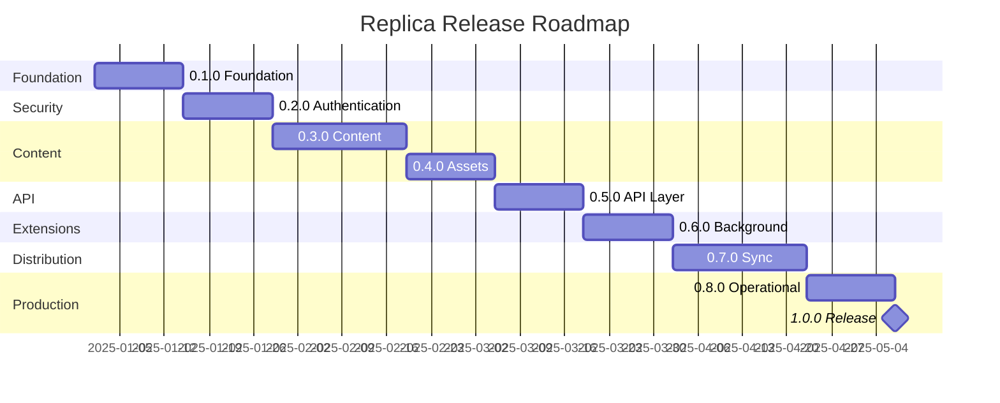
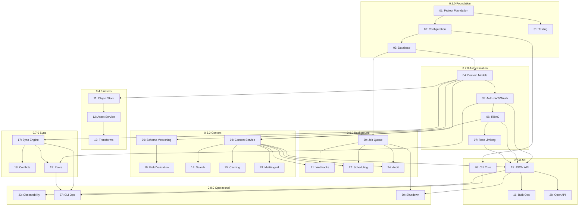

# Replica Release Roadmap to 1.0

## Overview

This document outlines the incremental release path from 0.1.0 to 1.0 for Replica, a distributed Golang CMS. Each 0.x release delivers usable functionality that builds toward the complete 1.0 vision.

## Release Timeline



## Release Summary

| Version | Name | Focus | Tasks | Key Deliverables |
|---------|------|-------|-------|------------------|
| **0.1.0** | Foundation | Infrastructure | 01, 02, 03, 31 | Project structure, config, database abstraction, tests |
| **0.2.0** | Authentication | Security | 04, 05, 06, 07 | JWT/OAuth, RBAC, rate limiting, domain models |
| **0.3.0** | Content | Core CMS | 08, 09, 10, 14, 25, 29 | Content CRUD, schema versioning, validation, search |
| **0.4.0** | Assets | Media | 11, 12, 13 | Object store, asset versioning, image transforms |
| **0.5.0** | API | REST | 15, 16, 26, 28 | JSON:API, bulk operations, CLI core, OpenAPI |
| **0.6.0** | Background | Async | 20, 21, 22, 24 | Job queue, webhooks, scheduling, audit log |
| **0.7.0** | Sync | Distribution | 17, 18, 19 | Push/pull sync, conflict resolution, federation |
| **0.8.0** | Operational | Production | 23, 27, 30 | Observability, CLI ops, graceful shutdown |
| **1.0.0** | Release | Complete | - | Stable, production-ready distributed CMS |

## Cumulative Capability by Release

### After 0.1.0
- ✅ Go project builds and tests
- ✅ Configuration system works
- ✅ Database connections (SQLite, MySQL, PostgreSQL)
- ✅ CI/CD pipeline operational

### After 0.2.0
- ✅ User authentication with JWT
- ✅ Role-based access control
- ✅ Rate limiting protection
- ✅ Core domain models defined

### After 0.3.0
- ✅ Full content CRUD operations
- ✅ Schema versioning with migrations
- ✅ Field validation (CEL expressions)
- ✅ Full-text search
- ✅ Content caching
- ✅ Multilingual support

### After 0.4.0
- ✅ Binary asset upload/download
- ✅ Asset version history
- ✅ Image transformations (thumbnails, variants)
- ✅ Multiple object store backends

### After 0.5.0
- ✅ Complete JSON:API REST endpoints
- ✅ Bulk operations for imports
- ✅ CLI for basic operations
- ✅ OpenAPI documentation
- ⭐ **Milestone: Functional single-instance CMS**

### After 0.6.0
- ✅ Background job processing
- ✅ Webhook extensions
- ✅ Scheduled publishing
- ✅ Immutable audit log

### After 0.7.0
- ✅ Bidirectional content sync
- ✅ Conflict detection and resolution
- ✅ Peer instance federation
- ⭐ **Milestone: Distributed CMS capability**

### After 0.8.0
- ✅ Complete observability (logs, metrics, traces)
- ✅ Full CLI for all operations
- ✅ Graceful shutdown for containers
- ⭐ **Milestone: Production-ready**

## Task Distribution

```
Release 0.1.0: [01, 02, 03, 31]           4 tasks
Release 0.2.0: [04, 05, 06, 07]           4 tasks
Release 0.3.0: [08, 09, 10, 14, 25, 29]   6 tasks
Release 0.4.0: [11, 12, 13]               3 tasks
Release 0.5.0: [15, 16, 26, 28]           4 tasks
Release 0.6.0: [20, 21, 22, 24]           4 tasks
Release 0.7.0: [17, 18, 19]               3 tasks
Release 0.8.0: [23, 27, 30]               3 tasks
─────────────────────────────────────────────────
Total:                                    31 tasks
```

## Dependency Graph



## Release Documents

Each release has a detailed plan document:

| Release | Document |
|---------|----------|
| 0.1.0 | [release-0.1.0-foundation.md](release-0.1.0-foundation.md) |
| 0.2.0 | [release-0.2.0-authentication.md](release-0.2.0-authentication.md) |
| 0.3.0 | [release-0.3.0-content.md](release-0.3.0-content.md) |
| 0.4.0 | [release-0.4.0-assets.md](release-0.4.0-assets.md) |
| 0.5.0 | [release-0.5.0-api.md](release-0.5.0-api.md) |
| 0.6.0 | [release-0.6.0-background.md](release-0.6.0-background.md) |
| 0.7.0 | [release-0.7.0-sync.md](release-0.7.0-sync.md) |
| 0.8.0 | [release-0.8.0-operational.md](release-0.8.0-operational.md) |

## Key Milestones

### Milestone 1: Single-Instance CMS (0.5.0)
At this point, Replica functions as a complete single-instance CMS with:
- Full content management
- Asset handling
- REST API
- CLI tooling

This milestone enables early adopters to use Replica for basic CMS needs.

### Milestone 2: Distributed CMS (0.7.0)
At this point, Replica achieves its core differentiating capability:
- Content synchronization between instances
- Conflict resolution
- Federated content networks

This milestone enables the production-to-staging, blue/green, and CDN use cases.

### Milestone 3: Production Ready (0.8.0)
At this point, Replica is suitable for production deployment:
- Full observability
- Complete CLI
- Container-ready shutdown behavior

### Final: 1.0.0 Release
After 0.8.0, the path to 1.0 includes:
1. Comprehensive end-to-end testing
2. Performance optimization
3. Security hardening
4. Beta testing with early adopters
5. Documentation completion
6. Release candidate validation

## Deferred to Post-1.0

The following features are explicitly deferred:
- AI-assisted conflict resolution
- External identity provider (OIDC/SAML) integration
- Web admin UI
- Continuous replication (CouchDB-style)
- Multi-writer clustering

These may be considered for 1.1, 1.2, or 2.0 releases based on user feedback.
